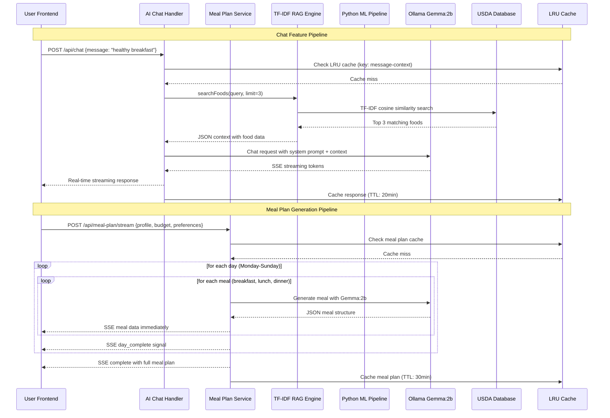
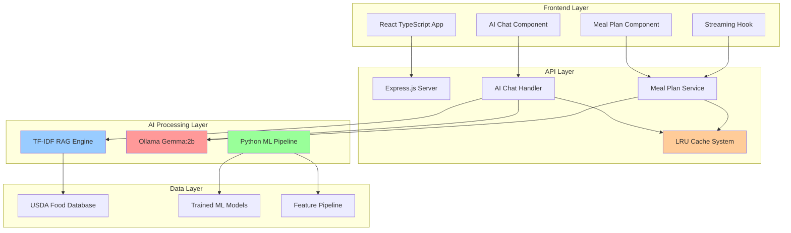

# 01 - NutriSolve AI Architecture Overview

## Master AI Pipeline Flow



## High-Level System Architecture



## Core AI Components Explained

### 1. TF-IDF Retrieval-Augmented Generation (RAG)
**Purpose**: Semantic search over USDA food database to provide relevant context to LLM
**Implementation**: Natural.js TfIdf library with cosine similarity
**Key Files**: 
- `backend/controllers/aiChatHandler.ts` (lines 170-191)

```typescript
function searchFoods(query: string, limit: number = 3): any[] {
  if (!tfidf || foods.length === 0) return [];

  const scores: Array<{ index: number; score: number }> = [];
  tfidf.tfidfs(query.toLowerCase(), (i: number, score: number) => {
    if (score > 0) {
      scores.push({ index: i, score });
    }
  });

  scores.sort((a, b) => b.score - a.score);
  return scores.slice(0, limit).map((s) => foods[s.index]);
}
```

### 2. Machine Learning Pipeline (Random Forest)
**Purpose**: Binary classification of food "fit score" based on nutritional features
**Implementation**: Python scikit-learn with SMOTE balancing
**Key Files**: 
- `backend/ml/preprocess.py` - Data preprocessing and SMOTE
- `backend/ml/train.py` - Random Forest training with GridSearchCV  
- `backend/ml/predict.py` - Real-time inference service

**Training Process**:
1. Generate 788 food samples (288 USDA + 500 synthetic)
2. Engineer 25 features → SelectKBest reduces to 10
3. Apply SMOTE to balance classes (64%→50% positive)
4. GridSearchCV finds optimal hyperparameters
5. Final model: `n_estimators=100, max_depth=10, min_samples_split=5`

### 3. Ollama Gemma:2b Local LLM
**Purpose**: Natural language generation for chat responses and meal plan creation
**Implementation**: Local deployment via Ollama client
**Key Configuration**:
```typescript
const ollama = new Ollama({
  host: process.env.OLLAMA_HOST || 'http://localhost:11434',
});

// Optimized parameters for speed
options: {
  num_predict: 100,    // Reduced for faster responses
  temperature: 0.7,    // Higher for more natural responses  
  num_ctx: 512,        // Smaller context window
  top_p: 0.9,          // More variety
  top_k: 20,           // More token choices
}
```

### 4. Intelligent Caching System
**Purpose**: Minimize LLM calls and improve response times
**Implementation**: Two-tier LRU cache system
```typescript
// Regular cache: 200 entries, 20min TTL
const responseCache = new LRUCache<string, string>({
  max: 200,
  ttl: 1000 * 60 * 20,
});

// Quick cache: 50 entries, 1hr TTL for common queries
const quickResponseCache = new LRUCache<string, string>({
  max: 50,
  ttl: 1000 * 60 * 60,
});
```

## Data Flow: User Click → Final Response

### Chat Feature Flow:
1. **User Input**: Types "healthy breakfast options" in chat
2. **Cache Check**: System checks LRU cache for existing response
3. **RAG Retrieval**: TF-IDF searches USDA database, returns top 3 foods
4. **Context Building**: Creates JSON context with nutritional data
5. **LLM Processing**: Ollama Gemma:2b generates response using context
6. **Streaming**: Response tokens streamed via SSE in real-time
7. **Caching**: Final response cached for future identical queries
8. **Frontend**: React component renders markdown-formatted response

### Meal Plan Generation Flow:
1. **User Profile**: Submits preferences (vegan, weight loss, $75 budget)
2. **Day Loop**: Backend generates 7 days sequentially
3. **Meal Loop**: For each day, generates breakfast/lunch/dinner individually
4. **LLM Calls**: Each meal = separate Gemma:2b call with structured JSON prompt
5. **Progressive Streaming**: Each meal sent to frontend immediately via SSE
6. **Frontend Rendering**: React hook processes stream, renders meal cards
7. **Completion**: Final meal plan with weekly totals sent
8. **Caching**: Complete plan cached for identical profile requests

## Performance Optimizations

### Backend Optimizations:
- **Concurrency Limiting**: p-limit restricts to 1 concurrent Ollama request
- **Model Warmup**: Gemma:2b warmed on startup to reduce first-request latency
- **Response Chunking**: Optimal SSE chunk sizes for smooth streaming
- **Fallback System**: Graceful degradation to generated meal data if Ollama fails

### Frontend Optimizations:  
- **Progressive Rendering**: Meals appear as generated, not all at once
- **State Management**: Efficient React hooks for streaming state
- **Error Boundaries**: Graceful handling of streaming interruptions
- **Markdown Optimization**: Custom components for faster AI response rendering

## How This Powers the User Experience

### Chat Feature:
- **Natural Conversations**: Users ask nutrition questions in plain English
- **Contextual Responses**: RAG ensures answers reference actual food data
- **Real-time Feedback**: Streaming creates sense of AI "thinking" and responding
- **Cached Speed**: Repeated questions answered instantly from cache

### Meal Plan Generation:
- **Personalized Plans**: AI considers dietary restrictions, goals, and budget
- **Visual Progress**: Users see meals appear progressively, building anticipation  
- **Variety & Quality**: Gemma:2b creates diverse, realistic meal combinations
- **Instant Modifications**: Plans generated fresh for each unique user profile

The entire pipeline is designed for speed, personalization, and user engagement, combining the best of semantic search, machine learning, and modern language models in a seamless experience.
