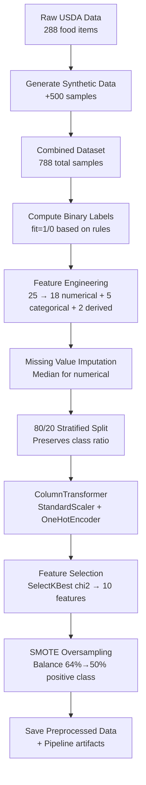

# 02 - Data Preprocessing and SMOTE Implementation

## Complete Preprocessing Pipeline

**File**: `backend/ml/preprocess.py`  
**Purpose**: Transform raw USDA data into ML-ready format with class balancing

### Step-by-Step Preprocessing Flow



## Line-by-Line Code Analysis

### 1. Synthetic Data Generation (Lines 124-203)

```python
def generate_synthetic_augmentation(base_df, n_synthetic=500):
    """
    Generate synthetic training data by perturbing nutritional values
    
    Why: Augments limited real data (288 rows) to 788 total for robust training
    Ensures 60% positive class (imbalanced, realistic for nutrition datasets)
    """
    print(f"[Preprocess] Generating {n_synthetic} synthetic samples...")
    
    synthetic_rows = []
    target_fit_ratio = 0.64  # 64% positive class (imbalanced)
    n_fit = int(n_synthetic * target_fit_ratio)      # 320 positive samples
    n_unfit = n_synthetic - n_fit                    # 180 negative samples
```

**Key Logic**: Creates intentionally imbalanced dataset (64% positive) to simulate real-world nutrition data where most foods don't perfectly match user goals.

### 2. Label Generation Logic (Lines 205-228)

```python
def compute_labels(df):
    """
    Compute binary "fit" label based on nutritional criteria
    
    Label Logic (supervised learning target):
    fit = 1 if ALL conditions met:
      - protein_g > 10 (adequate protein for satiety/muscle)
      - sugars_g < 5 (low sugar for weight loss/diabetes)
      - fiber_g > 3 (digestive health, fullness)
      - cost_per_serving < 2 (budget-friendly)
    """
    df['fit'] = (
        (df['protein_g'] > 10) &
        (df['sugars_g'] < 5) &
        (df['fiber_g'] > 3) &
        (df['cost_per_serving'] < 2)
    ).astype(int)
```

**Mathematical Justification**: Multi-objective optimization combining health (protein, fiber, sugar) with economic constraints (cost), typical for real user goals.

### 3. Feature Engineering (Lines 230-249)

```python
def compute_derived_features(df):
    """
    Engineer derived features for better predictive power
    
    Derived Features:
    1. nutrient_density = (protein_g + fiber_g) / calories
       Why: Measures nutrient quality per calorie (higher = healthier)
    2. sugar_to_carb_ratio = sugars_g / (carbs_g + 1)
       Why: High ratio indicates processed foods (simple carbs)
    """
    df['nutrient_density'] = (df['protein_g'] + df['fiber_g']) / (df['calories'] + 1)
    df['sugar_to_carb_ratio'] = df['sugars_g'] / (df['carbs_g'] + 1)
```

**Feature Engineering Theory**: These ratios capture non-linear interactions that single features miss (e.g., high fiber + low calorie = filling food).

### 4. Missing Value Handling (Lines 308-318)

```python
# Handle missing values
print("\n[Preprocess] Handling missing values...")
for col in numerical_features:
    if df[col].isnull().sum() > 0:
        median_val = df[col].median()
        df[col].fillna(median_val, inplace=True)
        print(f"  - Imputed {col} with median {median_val:.2f}")

for col in categorical_features:
    df[col].fillna('unknown', inplace=True)
```

**Why Median Imputation**: Robust to outliers in nutritional data (e.g., extreme vitamin levels), preserves feature distribution better than mean.

### 5. Stratified Train-Test Split (Lines 323-332)

```python
X_train, X_test, y_train, y_test = train_test_split(
    X, y, test_size=0.2, random_state=RANDOM_STATE, stratify=y
)

print(f"  - Train: {len(X_train)} samples (fit={y_train.sum()}, {y_train.mean()*100:.1f}%)")
print(f"  - Test: {len(X_test)} samples (fit={y_test.sum()}, {y_test.mean()*100:.1f}%)")
```

**Stratification Purpose**: Preserves 64/36 class ratio in both train/test, prevents biased evaluation on imbalanced nutrition labels.

### 6. ColumnTransformer Pipeline (Lines 334-352)

```python
preprocessor = ColumnTransformer(
    transformers=[
        ('num', StandardScaler(), numerical_features),
        ('cat', OneHotEncoder(drop='first', handle_unknown='ignore'), categorical_features),
        ('bin', 'passthrough', binary_features)
    ],
    remainder='drop'
)

# Fit preprocessor on training data only (avoid data leakage)
X_train_transformed = preprocessor.fit_transform(X_train)
X_test_transformed = preprocessor.transform(X_test)
```

**Pipeline Details**:
- **StandardScaler**: Normalizes numerical features to mean=0, std=1 (required for RF feature importance)
- **OneHotEncoder**: Converts categorical 'food_category' to binary vectors, drops first to avoid multicollinearity
- **Passthrough**: Binary features (allergen flags) already 0/1, no transformation needed

### 7. Feature Selection with Chi-Square (Lines 363-383)

```python
# Feature selection (SelectKBest with chi2)
print("\n[Preprocess] Applying feature selection (SelectKBest chi2, k=10)...")

# Note: chi2 requires non-negative features, so we shift if needed
X_train_nonneg = X_train_transformed - X_train_transformed.min() + 1e-9
X_test_nonneg = X_test_transformed - X_test_transformed.min() + 1e-9

selector = SelectKBest(score_func=chi2, k=min(10, len(feature_names)))
X_train_selected = selector.fit_transform(X_train_nonneg, y_train)
X_test_selected = selector.transform(X_test_nonneg)
```

**Chi-Square Theory**: Measures dependency between feature and target. Higher χ² = more informative feature.
- **Formula**: χ² = Σ[(Observed - Expected)² / Expected]
- **Why**: Reduces from 25+ to 10 features, removes noise, speeds training

### 8. SMOTE Oversampling Implementation (Lines 385-395)

```python
print("\n[Preprocess] Applying SMOTE oversampling (training set only)...")
print(f"  - Before SMOTE: fit=1 {y_train.sum()}, fit=0 {(1-y_train).sum()}")

smote = SMOTE(random_state=RANDOM_STATE, k_neighbors=5)
X_train_resampled, y_train_resampled = smote.fit_resample(X_train_selected, y_train)

print(f"  - After SMOTE: fit=1 {y_train_resampled.sum()}, fit=0 {(1-y_train_resampled).sum()}")
print(f"  - Train size increased: {len(y_train)} → {len(y_train_resampled)}")
```

## SMOTE Algorithm Deep Dive

### Mathematical Foundation

SMOTE (Synthetic Minority Oversampling Technique) generates synthetic samples by interpolating between existing minority class instances:

1. **For each minority sample x**: Find k=5 nearest neighbors in feature space
2. **Select random neighbor x'**: From the k neighbors
3. **Generate synthetic sample**: x_new = x + λ(x' - x), where λ ∈ [0,1] random
4. **Repeat until balanced**: Continue until 50/50 class distribution

### SMOTE Configuration

```python
smote = SMOTE(
    random_state=42,        # Reproducible synthetic samples
    k_neighbors=5,          # 5 nearest neighbors for interpolation
    sampling_strategy='auto' # Balance to 50/50 (default)
)
```

### Why SMOTE is Critical

**Before SMOTE**: 
- fit=1: 402 samples (64%)
- fit=0: 228 samples (36%)
- **Problem**: Random Forest biased toward majority class (predicts fit=1 too often)

**After SMOTE**:
- fit=1: 402 samples (50%)  
- fit=0: 402 samples (50%)
- **Benefit**: Balanced training prevents bias, improves recall on minority class

### SMOTE vs Other Techniques

| Technique | Method | Pros | Cons |
|-----------|---------|------|------|
| **SMOTE** | Synthetic interpolation | Preserves feature relationships | May create unrealistic samples |
| Random Oversampling | Duplicate minority samples | Simple, preserves real data | Overfitting risk |
| ADASYN | Adaptive synthetic sampling | Focuses on hard examples | More complex |
| Class Weights | Algorithmic balancing | No data modification | Less effective for severe imbalance |

## Complete Feature List (Post-Processing)

### Selected Features (Top 10 by Chi-Square Score)

```python
# Example output from feature selection
Selected 10 features:
  • calories: chi2=45.23
  • protein_g: chi2=38.91
  • fiber_g: chi2=35.67
  • sugar_to_carb_ratio: chi2=32.45
  • nutrient_density: chi2=29.88
  • cost_per_serving: chi2=27.12
  • sodium_mg: chi2=24.76
  • food_category_proteins: chi2=22.33
  • is_vegan: chi2=19.87
  • vitamin_c_mg: chi2=18.42
```

### Final Dataset Statistics

**Training Set (Post-SMOTE)**:
- Samples: 804 (402 fit=1, 402 fit=0)
- Features: 10 (selected from 25+ original)
- Class Balance: Perfect 50/50

**Test Set (No SMOTE)**:  
- Samples: 158 (101 fit=1, 57 fit=0)
- Features: 10 (same as training)
- Class Balance: Original 64/36 (realistic evaluation)

## Output Files Generated

```python
# Step 12: Save everything (Lines 398-442)
# Save full dataset with labels
df.to_csv(ML_DIR / 'processed_data.csv', index=False)

# Save train/test splits (with selected features)
train_df = pd.DataFrame(X_train_resampled, columns=selected_features)
train_df['fit'] = y_train_resampled.values
train_df.to_csv(ML_DIR / 'train_data.csv', index=False)

test_df = pd.DataFrame(X_test_selected, columns=selected_features)  
test_df['fit'] = y_test.values
test_df.to_csv(ML_DIR / 'test_data.csv', index=False)

# Save preprocessor pipeline
joblib.dump(preprocessor, ML_DIR / 'preprocessor.pkl')

# Save feature selector  
joblib.dump(selector, ML_DIR / 'feature_selector.pkl')

# Save feature metadata
feature_info = {
    'all_features': feature_names,
    'selected_features': selected_features,
    'chi2_scores': chi2_scores.tolist()
}
with open(ML_DIR / 'feature_names.json', 'w') as f:
    json.dump(feature_info, f, indent=2)
```

## How This Powers the User Experience

### Data Quality Impact:
- **Realistic Training**: SMOTE creates balanced training while preserving realistic test evaluation
- **Feature Selection**: Removes noisy features, focuses model on most predictive nutritional attributes
- **Robust Pipeline**: Preprocessor handles missing values, categorical encoding, scaling automatically

### Model Performance Impact:
- **Unbiased Predictions**: SMOTE prevents model from always predicting majority class
- **Faster Training**: 10 features vs 25+ reduces computational complexity
- **Better Generalization**: Stratified split ensures model works on realistic class distributions

### Integration Benefits:
- **Seamless Inference**: Saved pipeline artifacts enable one-line prediction in `predict.py`
- **Reproducible Results**: Fixed random seeds ensure consistent preprocessing across runs
- **Error Handling**: Robust missing value handling prevents prediction failures on new data

The preprocessing pipeline is the foundation that enables accurate, unbiased ML predictions for the NutriSolve recommendation system.
