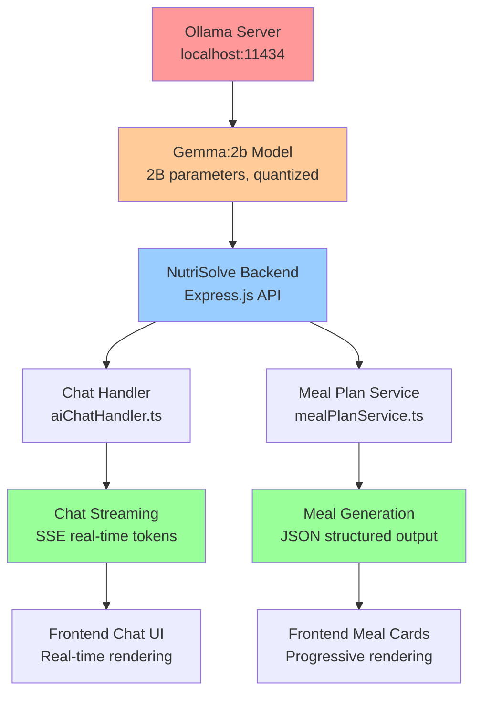

# 06 - Ollama Integration and LLM Configuration

**Files**: 
- `backend/controllers/aiChatHandler.ts` (Chat responses)
- `backend/controllers/mealPlanService.ts` (Meal plan generation)

**Purpose**: Local LLM deployment using Ollama with Gemma:2b for natural language generation

## Ollama Architecture Overview



## Ollama Client Configuration

### 1. Client Initialization (Lines 17-20)

```typescript
// Initialize Ollama client with optimized settings
const ollama = new Ollama({
  host: process.env.OLLAMA_HOST || 'http://localhost:11434',
});
```

**Configuration Details**:
- **Local Deployment**: localhost:11434 (Ollama default port)
- **Environment Override**: Supports production deployment via OLLAMA_HOST
- **No Authentication**: Local deployment assumes trusted environment
- **HTTP Protocol**: Standard REST API communication

### 2. Model Selection Strategy (Lines 22-36)

```typescript
// Model fallback configuration (fastest to slowest)
const MODELS = [
  'gemma:2b',      // Fastest, smaller model
  'phi3:mini',     // Medium speed, good quality
];

let currentModelIndex = 0;

// Get current model with fallback (force gemma:2b for speed)
const getCurrentModel = () => {
  return 'gemma:2b'; // Force fastest model
};
```

**Model Selection Rationale**:
- **Primary**: Gemma:2b (2 billion parameters, Google's efficient model)
- **Fallback**: Phi3:mini (Microsoft's compact model)
- **Speed Priority**: Favor response time over absolute quality
- **Local Constraints**: Models sized for consumer hardware

## Model Warm-up System

### 1. Chat Model Warm-up (Lines 38-74)

```typescript
const warmUpChatModel = async () => {
  if (isChatModelWarmedUp) return;
  
  const model = getCurrentModel();
  try {
    console.log(`[Chat] Warming up ${model} model for chat...`);
    const startTime = Date.now();
    
    await ollama.chat({
      model,
      messages: [{ role: 'user', content: 'Hi' }],
      options: {
        num_predict: 5,
        temperature: 0.1,
        num_ctx: 512, // Minimal context for warm-up
      },
    });
    
    const duration = Date.now() - startTime;
    console.log(`[Chat] Chat model ${model} warmed up in ${duration}ms`);
    isChatModelWarmedUp = true;
  } catch (error: any) {
    console.warn(`[Chat] Chat model ${model} warm-up failed:`, error.message);
  }
};
```

**Warm-up Strategy**:
- **Minimal Request**: Single "Hi" message to initialize model
- **Fast Parameters**: num_predict=5, low temperature for quick response
- **Context Limit**: 512 tokens to minimize memory allocation
- **Timing**: Measures and logs warm-up duration
- **Error Handling**: Graceful failure with fallback model attempt

### 2. Meal Plan Model Warm-up (Lines 27-52)

```typescript
const warmUpModel = async () => {
  if (isModelWarmedUp) return;
  
  try {
    const model = getMealPlanModel();
    console.log(`[MealPlan] Warming up ${model} model...`);
    const startTime = Date.now();
    
    await ollama.chat({
      model,
      messages: [{ role: 'user', content: 'Ready' }],
      options: {
        num_predict: 10,
        temperature: 0.1,
        num_ctx: 512, // Minimal context for warm-up
      },
    });
    
    const duration = Date.now() - startTime;
    console.log(`[MealPlan] Model warmed up in ${duration}ms`);
    isModelWarmedUp = true;
  } catch (error: any) {
    console.warn('[MealPlan] Model warm-up failed:', error.message);
  }
};
```

## System Prompts and Templates

### 1. Chat System Prompt (Lines 254-255)

```typescript
// OPTIMIZATION 7: Simplified system prompt for faster responses
const system = 'You are a helpful nutrition assistant. Give brief, practical advice.';
const userPrompt = message; // Simplified prompt without heavy context
```

**Design Principles**:
- **Brevity**: Short system prompt reduces token overhead
- **Role Definition**: Clear identity as nutrition assistant
- **Instruction Clarity**: "Brief, practical" guides response style
- **Context Separation**: User message passed separately

### 2. Meal Plan System Prompt (Lines 175-176)

```typescript
const systemPrompt = `You are a professional nutritionist and meal planning expert. Generate detailed, realistic meal plans based on user profiles and constraints. Generate the meal plan day by day, providing complete JSON for each day as you go. Always respond with valid JSON only, no additional text.`;
```

**Structured Generation Focus**:
- **Professional Role**: Establishes expertise and authority
- **Output Format**: Emphasizes JSON-only responses
- **Progressive Generation**: Day-by-day instruction for streaming
- **Constraint Awareness**: References user profiles and limitations

### 3. Meal Generation Prompt Template (Lines 232-266)

```typescript
const dayPrompt = `Create ${day} meal plan for: ${goal}, ${restrictions.length > 0 ? restrictions.join('/') : 'no restrictions'}, ${budgetText}, ${preferences || 'balanced meals'}.

Return ONLY valid JSON:
{
  "day": "${day}",
  "meals": [
    {
      "type": "breakfast",
      "name": "Specific meal name",
      "calories": 300,
      "protein": 15,
      "carbs": 35,
      "fat": 10,
      "ingredients": ["ingredient1", "ingredient2", "ingredient3"]
    },
    {
      "type": "lunch", 
      "name": "Specific meal name",
      "calories": 400,
      "protein": 25,
      "carbs": 40,
      "fat": 15,
      "ingredients": ["ingredient1", "ingredient2", "ingredient3"]
    },
    {
      "type": "dinner",
      "name": "Specific meal name", 
      "calories": 350,
      "protein": 20,
      "carbs": 30,
      "fat": 12,
      "ingredients": ["ingredient1", "ingredient2", "ingredient3"]
    }
  ]
}`;
```

**Template Structure**:
- **Context Variables**: Day, goal, restrictions, budget, preferences
- **JSON Schema**: Exact structure expected in response
- **Example Values**: Realistic nutritional numbers for guidance
- **Field Requirements**: Specific meal names and ingredient lists

## LLM Parameter Optimization

### 1. Chat Parameters (Lines 284-291)

```typescript
options: {
  num_predict: 100,    // Reduced for faster responses
  temperature: 0.7,    // Higher for more natural responses
  num_ctx: 512,        // Smaller context window
  top_p: 0.9,          // More variety
  top_k: 20,           // More token choices
}
```

**Parameter Explanations**:

| Parameter | Value | Purpose | Impact |
|-----------|-------|---------|---------|
| `num_predict` | 100 | Max tokens to generate | Shorter responses, faster generation |
| `temperature` | 0.7 | Randomness in token selection | Natural language, some creativity |
| `num_ctx` | 512 | Context window size | Lower memory usage, faster processing |
| `top_p` | 0.9 | Nucleus sampling threshold | Balanced variety vs coherence |
| `top_k` | 20 | Top-k token filtering | Moderate choice diversity |

### 2. Meal Plan Parameters (Lines 302-308)

```typescript
options: { 
  num_predict: 120,
  temperature: 0.4,
  num_ctx: 512,
  top_k: 20,
  top_p: 0.9,
}
```

**Meal Plan Specific Tuning**:
- **num_predict: 120**: Slightly longer for structured JSON output
- **temperature: 0.4**: Lower for more consistent meal structure
- **Deterministic Bias**: Favors realistic, nutritionally sound meals

### 3. Retry Parameters (Lines 318-325)

```typescript
options: {
  num_predict: 400,    // Higher for retry
  temperature: 0.4,
  num_ctx: 1024,
  top_p: 0.8,
  top_k: 15,
  repeat_penalty: 1.1,
}
```

**Retry Strategy**:
- **Longer Generation**: 400 tokens for complete responses
- **Larger Context**: 1024 tokens for complex queries
- **Repeat Penalty**: 1.1 reduces repetitive text
- **Conservative Sampling**: Lower top_p/top_k for coherence

## Streaming Implementation

### 1. Server-Sent Events Setup (Lines 258-263)

```typescript
if (stream) {
  res.writeHead(200, {
    'Content-Type': 'text/event-stream',
    'Cache-Control': 'no-cache',
    'Connection': 'keep-alive',
  });
```

**SSE Configuration**:
- **Content-Type**: text/event-stream for browser SSE support
- **Cache-Control**: no-cache prevents response caching
- **Connection**: keep-alive maintains persistent connection
- **CORS**: Implicit support for cross-origin streaming

### 2. Token Streaming Loop (Lines 277-301)

```typescript
const response = await ollama.chat({
  model: getCurrentModel(),
  messages: [
    { role: 'system', content: system },
    { role: 'user', content: userPrompt },
  ],
  stream: true,
  options: { /* ... */ },
});

let chunkCount = 0;
for await (const chunk of response) {
  const content = chunk.message?.content || '';
  if (content) {
    fullResponse += content;
    chunkCount++;
    res.write(`data: ${JSON.stringify({ content })}\n\n`);
  }
}
```

**Streaming Process**:
1. **Async Iterator**: `for await` handles streaming response
2. **Chunk Processing**: Extract content from each response chunk
3. **SSE Format**: `data: {JSON}\n\n` format for browser compatibility
4. **Accumulation**: Build complete response for caching
5. **Metrics**: Track chunk count for performance monitoring

### 3. Meal Plan Progressive Streaming (Lines 342-350)

```typescript
// Send meal immediately
res.write(`data: ${JSON.stringify({ 
  type: 'meal', 
  meal: meal
})}\n\n`);

console.log(`[MealPlan] 📤 Sent ${day} ${mealType}: ${meal.name}`);
```

**Progressive Rendering**:
- **Immediate Dispatch**: Each meal sent as soon as generated
- **Type Discrimination**: 'meal', 'day_complete', 'complete' message types
- **Frontend Integration**: React hooks process stream in real-time
- **User Experience**: Visual feedback during 30-60 second generation

## Error Handling and Fallbacks

### 1. Model Fallback Strategy (Lines 59-71)

```typescript
} catch (error: any) {
  console.warn(`[Chat] Chat model ${model} warm-up failed:`, error.message);
  
  // Try fallback model
  if (currentModelIndex < MODELS.length - 1) {
    currentModelIndex++;
    console.log(`[Chat] Trying fallback model: ${MODELS[currentModelIndex]}`);
    isChatModelWarmedUp = false;
    return warmUpChatModel();
  }
}
```

**Fallback Logic**:
- **Automatic Retry**: Switch to next model in MODELS array
- **Recursive Call**: Re-attempt warm-up with fallback model
- **State Reset**: Clear warm-up flag to force re-initialization
- **Logging**: Clear error messages for debugging

### 2. Timeout Handling (Lines 295-312)

```typescript
const response = await Promise.race([
  ollama.chat({
    model: getMealPlanModel(),
    messages: [
      { role: 'system', content: 'You are a nutritionist. Return ONLY valid JSON, no markdown, no explanation.' },
      { role: 'user', content: mealPrompt },
    ],
    options: { /* ... */ },
  }),
  new Promise((_, reject) => 
    setTimeout(() => reject(new Error('Gemma timeout after 60s')), 60000)
  )
]);
```

**Timeout Strategy**:
- **Promise.race**: Timeout vs actual response
- **60-Second Limit**: Prevents hanging on complex meal generation
- **Graceful Degradation**: Falls back to synthetic meal data
- **User Experience**: Maintains responsive interface

### 3. JSON Parsing Recovery (Lines 321-332)

```typescript
try {
  // Try to extract JSON from markdown code blocks
  const jsonMatch = content.match(/```(?:json)?\s*([\s\S]*?)\s*```/);
  const jsonString = jsonMatch ? jsonMatch[1] : content;
  meal = JSON.parse(jsonString.trim());
  console.log(`[MealPlan] ✅ Successfully parsed Gemma JSON for ${day} ${mealType}`);
} catch (parseError) {
  console.log(`[MealPlan] ⚠️ Failed to parse Gemma response, using fallback`);
  const fallbackDay = generateRealisticDayPlan(day, profile, preferences);
  meal = fallbackDay.meals.find((m: any) => m.type === mealType) || fallbackDay.meals[0];
}
```

**Robust Parsing**:
- **Markdown Extraction**: Handles LLM responses wrapped in code blocks
- **JSON Validation**: Attempts parsing with error catching
- **Synthetic Fallback**: Pre-generated meals when LLM fails
- **Seamless UX**: User sees realistic meals regardless of LLM issues

## Performance Monitoring

### 1. Response Time Tracking (Lines 294-318)

```typescript
const gemmaStartTime = Date.now();
const response = await Promise.race([/* ... */]);

const gemmaTime = Date.now() - gemmaStartTime;
console.log(`[MealPlan] ✅ Gemma responded in ${gemmaTime}ms`);
console.log(`[MealPlan] 📝 Raw Gemma output: ${content.substring(0, 200)}...`);
```

**Metrics Collected**:
- **Response Latency**: Time from request to first token
- **Content Preview**: First 200 chars for quality assessment
- **Success/Failure Rates**: Logs for monitoring LLM reliability
- **Chunk Metrics**: Token count and streaming performance

### 2. Concurrency Control (Lines 92-94)

```typescript
// OPTIMIZATION 2: Concurrency limiter using p-limit (prevents OOM/swapping)
const limit = pLimit(1); // Max 1 concurrent request to prevent memory issues
```

**Resource Management**:
- **Single Concurrency**: Prevents Ollama server overload
- **Memory Protection**: Avoids out-of-memory errors
- **Queue Management**: p-limit handles request queuing
- **Graceful Degradation**: Maintains system stability under load

## Ollama Configuration Examples

### 1. Development Configuration
```bash
# Start Ollama server
ollama serve

# Pull Gemma:2b model (first time)
ollama pull gemma:2b

# Verify model loading
curl http://localhost:11434/api/tags
```

### 2. Production Configuration
```bash
# Environment variables
export OLLAMA_HOST=http://localhost:11434
export OLLAMA_MODELS=/path/to/models
export OLLAMA_NUM_PARALLEL=1

# Systemd service for auto-restart
sudo systemctl enable ollama
sudo systemctl start ollama
```

### 3. Model Optimization
```bash
# Check model memory usage
ollama show gemma:2b

# Custom model configuration (Modelfile)
FROM gemma:2b
PARAMETER num_ctx 1024
PARAMETER num_predict 256
PARAMETER temperature 0.7
```

## How This Powers the User Experience

### Natural Conversations:
- **Local Privacy**: All AI processing happens on-device, no external API calls
- **Fast Responses**: Optimized parameters balance speed with quality
- **Streaming Feedback**: Real-time token generation creates engaging experience
- **Contextual Awareness**: RAG integration provides grounded, relevant responses

### Reliable Meal Planning:
- **Progressive Generation**: Users see meals appear in real-time
- **Structured Output**: JSON format ensures consistent meal card rendering
- **Fallback Quality**: Synthetic meals maintain experience during LLM failures
- **Personalization**: User profiles integrated into prompt templates

### Production Readiness:
- **Error Recovery**: Multiple fallback strategies prevent system failures
- **Resource Management**: Concurrency limits protect server stability
- **Performance Monitoring**: Comprehensive logging enables optimization
- **Scalable Architecture**: Local deployment reduces external dependencies

The Ollama integration provides the core natural language generation capabilities that power both conversational AI features and automated meal planning, all while maintaining privacy through local deployment and ensuring reliable performance through comprehensive error handling.
