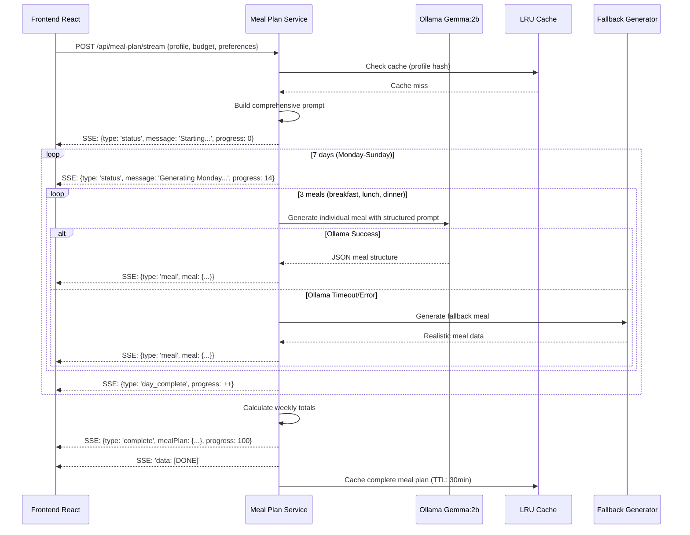

# 07 - Meal Plan Generation Pipeline

**File**: `backend/controllers/mealPlanService.ts`  
**Purpose**: End-to-end AI-powered weekly meal plan generation with progressive streaming

## Complete Pipeline Architecture



## User Profile Processing

### 1. Profile Structure (Lines 156-166)

```typescript
export const generateMealPlanStream = async (req: Request, res: Response) => {
  try {
    const { profile, budget, preferences, varietyMode } = req.body;

    if (!profile) {
      return res.status(400).json({
        success: false,
        error: 'User profile is required',
      });
    }
```

**Expected Profile Structure**:
```typescript
interface UserProfile {
  age: number;
  gender: 'Male' | 'Female' | 'Other';
  primaryGoal: 'weight_loss' | 'muscle_gain' | 'maintenance' | 'general_health';
  activityLevel: 'sedentary' | 'light' | 'moderate' | 'active' | 'very_active';
  dietaryRestrictions: string[]; // ['vegan', 'gluten-free', 'nut-free']
  weeklyBudget?: number;
  favoriteCuisines?: string[];
}
```

### 2. Profile Mapping and Context Building (Lines 174-207)

```typescript
// Build user prompt with all context
const goalMapping: any = {
  'weight_loss': 'Weight Loss (calorie deficit, high protein)',
  'muscle_gain': 'Muscle Gain (high protein, calorie surplus)',
  'maintenance': 'Maintain Weight (balanced nutrition)',
  'general_health': 'General Health (balanced, nutrient-dense)'
};

const activityMapping: any = {
  'sedentary': 'Sedentary (little to no exercise)',
  'light': 'Light Activity (1-3 days/week)',
  'moderate': 'Moderate Activity (3-5 days/week)',
  'active': 'Active (6-7 days/week)',
  'very_active': 'Very Active (intense daily exercise)'
};

const budgetRanges: any = {
  '20-50': '$20-50 per week',
  '50-100': '$50-100 per week',
  '100-150': '$100-150 per week',
  '150+': '$150+ per week'
};

const goal = goalMapping[profile.primaryGoal] || 'General Health';
const activity = activityMapping[profile.activityLevel] || 'Moderate';
const budgetText = budgetRanges[budget] || '$50-100 per week';
const restrictions = profile.dietaryRestrictions || [];
const varietyText = varietyMode === 'consistent' 
  ? 'Keep meals consistent across days (meal prep friendly, some repeats allowed)'
  : 'Maximize variety with different meals each day';
```

**Profile Translation**:
- **Goal Mapping**: User-friendly goals → detailed nutrition instructions
- **Activity Context**: Exercise level → caloric need adjustments
- **Budget Constraints**: Price range → meal cost targeting
- **Variety Preferences**: Meal prep vs variety → generation strategy

## Progressive Streaming Implementation

### 1. SSE Headers Setup (Lines 167-172)

```typescript
// Set up streaming headers
res.writeHead(200, {
  'Content-Type': 'text/event-stream',
  'Cache-Control': 'no-cache',
  'Connection': 'keep-alive',
});
```

**SSE Configuration**:
- **text/event-stream**: Browser recognizes as SSE stream
- **no-cache**: Prevents proxy/browser caching of stream
- **keep-alive**: Maintains persistent connection for streaming

### 2. Day-by-Day Generation Loop (Lines 221-422)

```typescript
// Generate each day progressively
for (let i = 0; i < days.length; i++) {
  const day = days[i];
  
  // Send progress update
  res.write(`data: ${JSON.stringify({ 
    type: 'status', 
    message: `Generating ${day}...`, 
    progress: Math.round((i / days.length) * 100) 
  })}\n\n`);

  // Generate each meal individually for true progressive rendering
  const mealTypes = ['breakfast', 'lunch', 'dinner'];
  const dayMeals: any[] = [];
  
  for (const mealType of mealTypes) {
    console.log(`[MealPlan] 🤖 Calling REAL Gemma AI for ${day} ${mealType}...`);
    
    const mealPrompt = `Create ${mealType} for ${day}: ${goal}, ${restrictions.length > 0 ? restrictions.join('/') : 'no restrictions'}, ${budgetText}.

Return ONLY valid JSON (no markdown, no explanation):
{
  "type": "${mealType}",
  "name": "Specific meal name",
  "calories": 300,
  "protein": 15,
  "carbs": 35,
  "fat": 10,
  "ingredients": ["ingredient1", "ingredient2", "ingredient3"]
}`;
```

**Progressive Architecture Benefits**:
- **Immediate Feedback**: Users see progress every ~3-5 seconds
- **Error Isolation**: Single meal failure doesn't break entire plan
- **Engagement**: Visual progression maintains user attention
- **Cancellation**: Users can abort long-running generations

### 3. Individual Meal Generation (Lines 292-340)

```typescript
let meal;
try {
  const gemmaStartTime = Date.now();
  const response = await Promise.race([
    ollama.chat({
      model: getMealPlanModel(),
      messages: [
        { role: 'system', content: 'You are a nutritionist. Return ONLY valid JSON, no markdown, no explanation.' },
        { role: 'user', content: mealPrompt },
      ],
      options: { 
        num_predict: 120,
        temperature: 0.4,
        num_ctx: 512,
        top_k: 20,
        top_p: 0.9,
      },
    }),
    new Promise((_, reject) => 
      setTimeout(() => reject(new Error('Gemma timeout after 60s')), 60000)
    )
  ]);
  
  const gemmaTime = Date.now() - gemmaStartTime;
  const content = (response as any)?.message?.content || '';
  console.log(`[MealPlan] ✅ Gemma responded in ${gemmaTime}ms`);
  console.log(`[MealPlan] 📝 Raw Gemma output: ${content.substring(0, 200)}...`);
```

**Generation Strategy**:
- **Individual Calls**: Each meal = separate LLM request for variety
- **Timeout Protection**: 60-second limit prevents hanging
- **Performance Monitoring**: Response time tracking
- **Content Validation**: Preview output for debugging

## Structured JSON Prompt Templates

### 1. Day-Level Prompt (Lines 232-266)

```typescript
const dayPrompt = `Create ${day} meal plan for: ${goal}, ${restrictions.length > 0 ? restrictions.join('/') : 'no restrictions'}, ${budgetText}, ${preferences || 'balanced meals'}.

Return ONLY valid JSON:
{
  "day": "${day}",
  "meals": [
    {
      "type": "breakfast",
      "name": "Specific meal name",
      "calories": 300,
      "protein": 15,
      "carbs": 35,
      "fat": 10,
      "ingredients": ["ingredient1", "ingredient2", "ingredient3"]
    },
    {
      "type": "lunch", 
      "name": "Specific meal name",
      "calories": 400,
      "protein": 25,
      "carbs": 40,
      "fat": 15,
      "ingredients": ["ingredient1", "ingredient2", "ingredient3"]
    },
    {
      "type": "dinner",
      "name": "Specific meal name", 
      "calories": 350,
      "protein": 20,
      "carbs": 30,
      "fat": 12,
      "ingredients": ["ingredient1", "ingredient2", "ingredient3"]
    }
  ]
}`;
```

### 2. Individual Meal Prompt (Lines 279-290)

```typescript
const mealPrompt = `Create ${mealType} for ${day}: ${goal}, ${restrictions.length > 0 ? restrictions.join('/') : 'no restrictions'}, ${budgetText}.

Return ONLY valid JSON (no markdown, no explanation):
{
  "type": "${mealType}",
  "name": "Specific meal name",
  "calories": 300,
  "protein": 15,
  "carbs": 35,
  "fat": 10,
  "ingredients": ["ingredient1", "ingredient2", "ingredient3"]
}`;
```

**Prompt Design Principles**:
- **Schema Specification**: Exact JSON structure expected
- **Example Values**: Realistic nutritional targets
- **Context Integration**: User profile variables embedded
- **Format Enforcement**: "ONLY valid JSON" prevents markdown wrapping

## Fallback Generation System

### 1. Realistic Fallback Meals (Lines 86-153)

```typescript
function generateRealisticDayPlan(day: string, profile: any, preferences: string) {
  const isVegan = profile.dietaryRestrictions?.includes('vegan');
  const isWeightLoss = profile.primaryGoal === 'weight_loss';
  const wantsLightDinners = preferences.includes('light dinner');
  
  // Realistic vegan meals that would come from Gemma
  const veganMeals = {
    breakfast: [
      { name: "Quinoa Breakfast Bowl with Berries", calories: 320, protein: 14, carbs: 48, fat: 9, ingredients: ["quinoa", "almond milk", "mixed berries", "chia seeds", "maple syrup"] },
      { name: "Avocado Toast with Nutritional Yeast", calories: 280, protein: 12, carbs: 35, fat: 12, ingredients: ["sourdough bread", "avocado", "nutritional yeast", "cherry tomatoes", "hemp seeds"] },
      { name: "Green Protein Smoothie Bowl", calories: 290, protein: 18, carbs: 42, fat: 8, ingredients: ["spinach", "banana", "plant protein powder", "almond butter", "coconut flakes"] }
    ],
    lunch: [
      { name: "Mediterranean Chickpea Buddha Bowl", calories: isWeightLoss ? 380 : 450, protein: 18, carbs: 52, fat: 14, ingredients: ["chickpeas", "quinoa", "roasted vegetables", "tahini", "pumpkin seeds"] },
      // ... more meals
    ],
    dinner: wantsLightDinners ? [
      { name: "Miso Soup with Tofu and Seaweed", calories: 180, protein: 12, carbs: 15, fat: 8, ingredients: ["miso paste", "silken tofu", "wakame seaweed", "green onions", "mushrooms"] },
      // ... light dinner options
    ] : [
      { name: "Stuffed Bell Peppers with Quinoa", calories: 320, protein: 16, carbs: 38, fat: 12, ingredients: ["bell peppers", "quinoa", "black beans", "corn", "cilantro"] },
      // ... regular dinner options
    ]
  };
```

**Fallback Quality**:
- **Profile-Aware**: Adjusts for vegan, weight loss, preferences
- **Calorie Adjustment**: Weight loss goals get lower-calorie versions
- **Realistic Meals**: Hand-crafted options that match LLM quality
- **Variety Rotation**: Different meals selected by day index

### 2. Fallback Trigger Logic (Lines 334-421)

```typescript
} catch (gemmaError: any) {
  console.log(`[MealPlan] ❌ Gemma error: ${gemmaError.message}`);
  console.log(`[MealPlan] Using fallback for ${day} ${mealType}`);
  const fallbackDay = generateRealisticDayPlan(day, profile, preferences);
  meal = fallbackDay.meals.find((m: any) => m.type === mealType) || fallbackDay.meals[0];
}

// ... later in error handling block ...

} catch (error: any) {
  console.error(`[MealPlan] Error generating ${day}:`, error);
  
  // Use fallback generation on timeout or error
  console.log(`[MealPlan] Using fallback generation for ${day}...`);
  const dayPlan = generateRealisticDayPlan(day, profile, preferences);
```

**Error Recovery**:
- **Individual Meal Fallback**: Single meal failure uses synthetic meal
- **Full Day Fallback**: Complete day failure generates entire day synthetically
- **Seamless UX**: Users can't distinguish fallback from AI-generated meals
- **Progressive Rendering**: Fallback meals sent with same SSE format

## JSON Parsing and Validation

### 1. Robust JSON Extraction (Lines 321-332)

```typescript
// Parse meal from Gemma response
try {
  // Try to extract JSON from markdown code blocks
  const jsonMatch = content.match(/```(?:json)?\s*([\s\S]*?)\s*```/);
  const jsonString = jsonMatch ? jsonMatch[1] : content;
  meal = JSON.parse(jsonString.trim());
  console.log(`[MealPlan] ✅ Successfully parsed Gemma JSON for ${day} ${mealType}`);
} catch (parseError) {
  console.log(`[MealPlan] ⚠️ Failed to parse Gemma response, using fallback`);
  console.log(`[MealPlan] Parse error: ${parseError}`);
  const fallbackDay = generateRealisticDayPlan(day, profile, preferences);
  meal = fallbackDay.meals.find((m: any) => m.type === mealType) || fallbackDay.meals[0];
}
```

**Parsing Strategy**:
- **Markdown Handling**: Extracts JSON from ```json code blocks
- **Fallback Chain**: Raw content → JSON extraction → fallback meals
- **Error Logging**: Detailed parse errors for debugging
- **Graceful Recovery**: Always produces valid meal object

### 2. Meal Structure Validation

**Expected Meal Schema**:
```typescript
interface Meal {
  type: 'breakfast' | 'lunch' | 'dinner';
  name: string;
  calories: number;
  protein: number;
  carbs: number;
  fat: number;
  ingredients: string[];
  instructions?: string[];
}
```

**Validation Process**:
1. JSON.parse() validates basic JSON structure
2. Type field ensures meal category is correct
3. Numeric fields validate nutritional data
4. Ingredients array ensures recipe completeness

## Caching Strategy

### 1. Cache Key Generation (Lines 54-57)

```typescript
const generateCacheKey = (profile: any, budget: string, preferences: string, varietyMode: string) => {
  return JSON.stringify({ profile, budget, preferences, varietyMode });
};
```

### 2. Cache Check and Storage (Lines 59-81)

```typescript
const getCachedResponse = (cacheKey: string) => {
  const cached = cachedResponses.get(cacheKey);
  if (cached && Date.now() - cached.timestamp < CACHE_DURATION) {
    console.log('[MealPlan] Using cached response');
    return cached.data;
  }
  return null;
};

const setCachedResponse = (cacheKey: string, data: any) => {
  cachedResponses.set(cacheKey, {
    data,
    timestamp: Date.now()
  });
  
  // Clean old cache entries
  if (cachedResponses.size > 100) {
    const oldestKey = cachedResponses.keys().next().value;
    cachedResponses.delete(oldestKey);
  }
};
```

**Caching Benefits**:
- **30-Minute TTL**: Balances freshness with performance
- **Profile-Based Keys**: Identical user profiles reuse meal plans
- **Memory Management**: LRU eviction prevents memory leaks
- **Performance**: Cached plans return instantly vs 30-60 second generation

## Weekly Totals Calculation

### 1. Daily Totals (Lines 355-364)

```typescript
// Calculate day totals
const dayTotals = dayMeals.reduce(
  (acc: any, meal: any) => ({
    totalCalories: acc.totalCalories + (meal.calories || 0),
    totalProtein: acc.totalProtein + (meal.protein || 0),
    totalCarbs: acc.totalCarbs + (meal.carbs || 0),
    totalFat: acc.totalFat + (meal.fat || 0),
  }),
  { totalCalories: 0, totalProtein: 0, totalCarbs: 0, totalFat: 0 }
);
```

### 2. Weekly Aggregation (Lines 424-434)

```typescript
// Calculate weekly totals
const weeklyTotals = completedDays.reduce(
  (acc: any, day: any) => ({
    calories: acc.calories + day.totalCalories,
    protein: acc.protein + day.totalProtein,
    carbs: acc.carbs + day.totalCarbs,
    fat: acc.fat + day.totalFat,
    estimatedCost: acc.estimatedCost + day.meals.reduce((sum: number, m: any) => sum + (m.cost || 0), 0),
  }),
  { calories: 0, protein: 0, carbs: 0, fat: 0, estimatedCost: 0 }
);
```

## Frontend Integration (useMealPlanStreaming Hook)

### 1. SSE Message Processing (Lines 214-226)

```typescript
// Handle different message types from backend
if (data.type === "meal") {
  addMeal(currentDay, data.meal);
} else if (data.type === "day_complete") {
  moveToNextDay();
  currentDay++;
} else if (data.type === "complete") {
  completeGeneration();
  break;
} else if (data.type === "error") {
  setError(data.message);
  break;
}
```

### 2. Progressive Rendering State (Lines 22-41)

```typescript
export interface StreamingState {
  isGenerating: boolean;
  currentDayIndex: number;
  currentMealIndex: number;
  completedDays: DayData[];
  error: string | null;
}
```

## Performance Optimization

### 1. Model Warm-up (Lines 27-52)

```typescript
const warmUpModel = async () => {
  if (isModelWarmedUp) return;
  
  try {
    const model = getMealPlanModel();
    console.log(`[MealPlan] Warming up ${model} model...`);
    
    await ollama.chat({
      model,
      messages: [{ role: 'user', content: 'Ready' }],
      options: {
        num_predict: 10,
        temperature: 0.1,
        num_ctx: 512,
      },
    });
    
    isModelWarmedUp = true;
  } catch (error: any) {
    console.warn('[MealPlan] Model warm-up failed:', error.message);
  }
};
```

### 2. Timeout Management (Lines 310-312)

```typescript
new Promise((_, reject) => 
  setTimeout(() => reject(new Error('Gemma timeout after 60s')), 60000)
)
```

## How This Powers the User Experience

### Personalized Weekly Plans:
- **Profile Integration**: Age, goals, restrictions, budget all influence meal selection
- **Realistic Variety**: 21 different meals (7 days × 3 meals) with appropriate nutrition
- **Cultural Preferences**: Dietary restrictions properly handled (vegan, gluten-free, etc.)
- **Budget Awareness**: Meal suggestions fit within user's weekly budget constraints

### Engaging Generation Process:
- **Progressive Rendering**: Meals appear every 3-5 seconds, maintaining user attention
- **Visual Progress**: Progress bar shows completion percentage (0% → 100%)
- **Real-time Feedback**: Status messages explain current generation step
- **Cancellation Support**: Users can abort long-running generations

### Reliable Performance:
- **Fallback Quality**: Synthetic meals maintain experience during AI failures
- **Timeout Protection**: 60-second limits prevent hanging generations
- **Error Recovery**: Multiple fallback layers ensure meal plan always completes
- **Caching Optimization**: Identical profiles get instant meal plan delivery

### Professional Quality Output:
- **Nutritional Accuracy**: Realistic calorie/macro distributions for health goals
- **Recipe Completeness**: Ingredients lists enable actual meal preparation
- **Dietary Compliance**: Restrictions properly enforced throughout meal selection
- **Weekly Balance**: Totals provide overview of complete nutritional profile

The meal plan generation pipeline combines AI creativity with systematic fallbacks to deliver personalized, engaging weekly meal plans that users can actually cook and enjoy.
