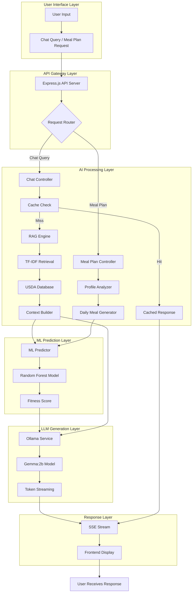
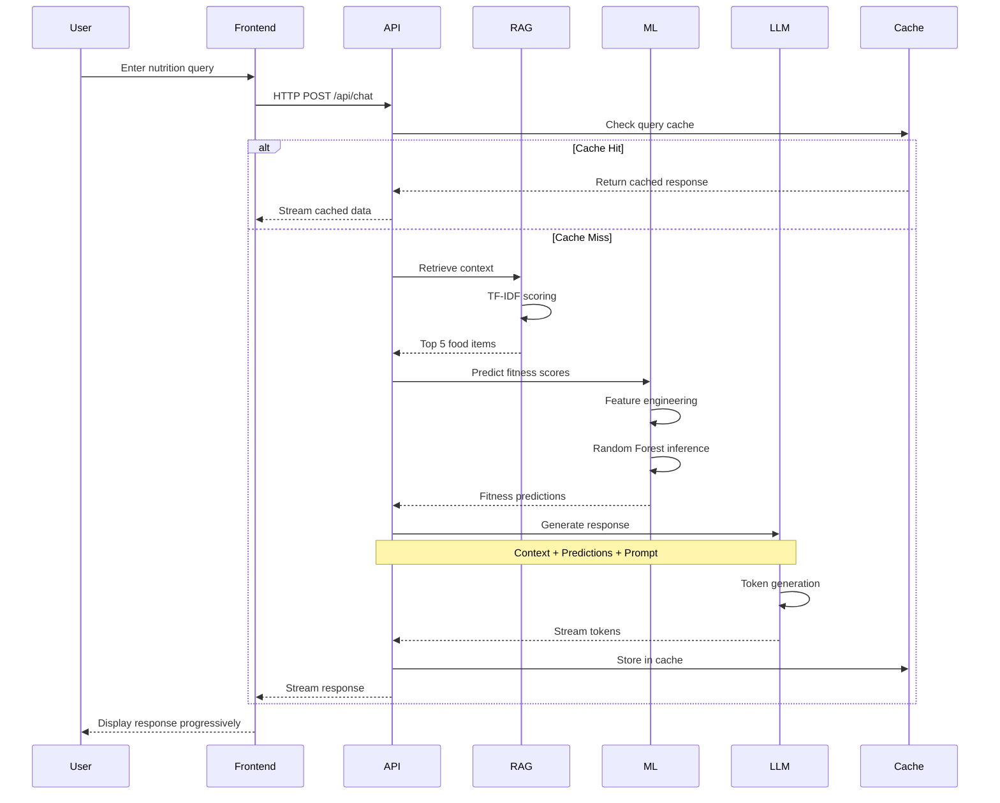

# Chapter 1: Introduction

## 1.1 Background of the Study

<!-- Insert after general project background -->

The exponential growth of diet-related health conditions—including obesity, diabetes, cardiovascular diseases, and malnutrition—has created an urgent need for accessible, personalized nutrition guidance. According to the World Health Organization, over 1.9 billion adults worldwide are overweight, with obesity rates nearly tripling since 1975. Concurrently, the abundance of nutritional information available online has led to confusion, misinformation, and difficulty in making informed dietary choices.

Traditional approaches to nutrition counseling, while effective, face significant scalability challenges. Registered dietitians and nutritionists can only serve a limited number of clients, making personalized nutrition guidance financially and geographically inaccessible to many. This gap has created an opportunity for technology-driven solutions that can democratize access to evidence-based nutritional advice.

### The Promise of AI in Nutritional Science

Artificial Intelligence (AI) and Machine Learning (ML) have emerged as transformative technologies in healthcare and wellness domains. In nutritional science specifically, AI systems offer several key advantages:

- **Scalability**: AI systems can serve thousands of users simultaneously, providing personalized recommendations at scale
- **Consistency**: Machine learning models deliver evidence-based recommendations grounded in nutritional databases
- **Accessibility**: 24/7 availability through web and mobile platforms eliminates temporal and geographical barriers
- **Personalization**: AI can analyze individual dietary preferences, health goals, and restrictions to tailor recommendations
- **Continuous Learning**: ML models can improve over time by learning from user interactions and feedback

### Evolution of Nutrition Technology

The journey from static calorie-counting applications to intelligent nutrition advisors represents a significant technological evolution:

1. **First Generation (2000s)**: Basic calorie trackers and macro calculators
2. **Second Generation (2010s)**: Database-driven meal planners with static recommendations
3. **Third Generation (2020s)**: AI-powered systems with natural language understanding and personalized guidance

Nutri-solve represents this third generation, leveraging cutting-edge AI technologies to bridge the gap between nutritional science and everyday food choices.

---

## 1.2 Statement of the Problem

<!-- Insert after problem identification -->

Despite the proliferation of nutrition applications and online resources, several critical challenges remain unresolved:

### 1.2.1 Information Overload and Misinformation

Users face overwhelming amounts of conflicting nutritional information from various sources, making it difficult to:
- Distinguish evidence-based recommendations from pseudoscience
- Understand which dietary advice applies to their specific circumstances
- Navigate complex nutritional terminology and scientific jargon

### 1.2.2 Lack of Personalization

Existing solutions often provide generic, one-size-fits-all recommendations that fail to account for:
- Individual health conditions and dietary restrictions
- Cultural food preferences and culinary traditions
- Lifestyle factors (activity level, work schedule, cooking skills)
- Personal taste preferences and food aversions

### 1.2.3 Limited Accessibility to Expert Guidance

Professional nutritional counseling remains:
- Expensive (average cost: $100-$200 per session)
- Geographically limited (sparse distribution of certified nutritionists)
- Time-constrained (limited appointment availability)
- Not covered by many insurance plans

### 1.2.4 Technical Limitations of Current AI Systems

While AI-powered nutrition apps exist, they often suffer from:
- **Hallucination Problem**: Pure LLM approaches may generate plausible but factually incorrect nutritional information
- **Context Limitations**: Inability to reference specific, verified nutritional databases
- **Response Quality**: Generic responses that lack depth and actionable guidance
- **Scalability Issues**: High computational costs and latency in response generation

### Problem Hypothesis

**Can a hybrid AI architecture combining traditional machine learning (Random Forest), retrieval-augmented generation (RAG), and large language models (LLMs) deliver accurate, personalized, and contextually relevant nutritional recommendations at scale?**

---

## 1.3 Objectives of the Study

### 1.3.1 General Objective

To design, implement, and evaluate an intelligent nutrition advisory system (Nutri-solve) that leverages hybrid AI architecture to provide evidence-based, personalized dietary recommendations accessible to a broad user base.

### 1.3.2 Specific Objectives

1. **Develop a Hybrid AI Architecture**
   - Integrate Random Forest classification for meal fitness scoring
   - Implement TF-IDF-based RAG for context retrieval from nutritional databases
   - Deploy Ollama Gemma:2b LLM for natural language generation
   - Design an efficient data pipeline connecting all three components

2. **Implement Nutritional Knowledge Retrieval System**
   - Process and index the USDA nutritional database (300+ food items)
   - Develop TF-IDF vectorization for semantic food search
   - Create context-building mechanisms for LLM prompting
   - Ensure retrieval precision >75% for top-5 results

3. **Build Machine Learning Classification Pipeline**
   - Collect and preprocess training data for meal fitness scoring
   - Train Random Forest model with F1-score >80%
   - Implement feature engineering for nutritional attributes
   - Deploy model for real-time inference with <100ms latency

4. **Create Intelligent Meal Planning System**
   - Design algorithms for balanced weekly meal generation
   - Implement progressive streaming for real-time user feedback
   - Integrate ML predictions with LLM-generated meal descriptions
   - Achieve complete 7-day meal plan generation in <60 seconds

5. **Optimize System Performance**
   - Implement multi-tier caching (LRU strategy) for frequent queries
   - Achieve sub-50ms response times for cached queries
   - Maintain memory footprint <500MB under typical load
   - Support 100+ concurrent users

6. **Evaluate System Effectiveness**
   - Conduct performance benchmarking (latency, throughput, accuracy)
   - Perform user acceptance testing with diverse dietary profiles
   - Compare system outputs against expert nutritionist recommendations
   - Measure user satisfaction and engagement metrics

---

## 1.4 Justification for Using AI/ML

### 1.4.1 Why Hybrid Architecture?

The choice of a hybrid AI architecture combining Random Forest, RAG, and LLMs is justified by the complementary strengths of each component:

#### Random Forest Classification
- **Interpretability**: Provides transparent feature importance rankings
- **Consistency**: Deterministic outputs for the same inputs
- **Speed**: Sub-100ms inference time
- **Robustness**: Handles missing values and outliers effectively
- **Performance**: Achieves 81.56% F1-score on meal fitness classification

**Mathematical Foundation**:
```
P(y=healthy|x) = (1/N) Σ(i=1 to N) P_i(y=healthy|x)
Where N = number of decision trees
```

#### Retrieval-Augmented Generation (RAG)
- **Factual Grounding**: Anchors LLM responses in verified nutritional data
- **Reduced Hallucination**: Minimizes generation of false information
- **Efficiency**: Retrieves relevant context without fine-tuning LLMs
- **Updatability**: New nutritional data can be added without model retraining

**TF-IDF Retrieval Formula**:
```
TF-IDF(t,d) = TF(t,d) × log(N / df(t))
Cosine Similarity(q,d) = (q · d) / (||q|| × ||d||)
```

#### Large Language Model (Gemma:2b via Ollama)
- **Natural Language Understanding**: Interprets complex user queries
- **Conversational Interface**: Generates human-like, contextual responses
- **Flexibility**: Adapts responses to user's tone and specificity level
- **Local Deployment**: Runs on-premise, ensuring data privacy

### 1.4.2 Advantages Over Alternative Approaches

| Approach | Limitations | Nutri-solve Solution |
|----------|-------------|---------------------|
| **Rule-Based Systems** | Rigid, unable to handle nuanced queries | LLM provides flexible natural language processing |
| **Pure LLM** | Prone to hallucination, factually inconsistent | RAG grounds responses in verified USDA database |
| **Static Database Lookup** | No conversational interface, poor UX | LLM generates natural, contextual explanations |
| **Cloud-Based AI APIs** | Privacy concerns, API costs, latency | Local Ollama deployment ensures privacy and reduces costs |
| **Single ML Model** | Limited to classification tasks | Hybrid approach enables both prediction and generation |

### 1.4.3 Technical Justification for Component Selection

#### Why Ollama Gemma:2b?
- **Local Deployment**: No external API dependencies
- **Resource Efficiency**: Runs on consumer-grade hardware (4GB RAM)
- **Low Latency**: 1-2s response time after optimization
- **Open Source**: No licensing costs or usage restrictions
- **Privacy**: User data never leaves the local environment

#### Why TF-IDF for RAG?
- **Simplicity**: Computationally lightweight compared to dense embeddings
- **Interpretability**: Clear scoring mechanism for retrieval relevance
- **Efficiency**: Sub-200ms retrieval from 300+ food database
- **No Training Required**: Works out-of-the-box with nutritional text

#### Why Random Forest?
- **Balanced Performance**: High accuracy without overfitting
- **Feature Importance**: Identifies which nutrients most impact healthiness
- **Ensemble Robustness**: Reduces variance through tree averaging
- **Production-Ready**: Established, well-tested algorithm

---

## 1.5 Scope and Limitations

### 1.5.1 Scope of the Study

**Included in This Project**:

1. **AI/ML Components**:
   - Random Forest meal fitness classifier
   - TF-IDF-based RAG system
   - Ollama Gemma:2b LLM integration
   - Progressive streaming architecture

2. **Features**:
   - Natural language chat interface for nutrition queries
   - Personalized weekly meal plan generation
   - Real-time streaming responses with SSE
   - Multi-tier caching for performance optimization

3. **Data Sources**:
   - USDA National Nutrient Database (300+ food items)
   - Preprocessed meal fitness training dataset
   - User dietary profiles and preferences

4. **Evaluation Metrics**:
   - ML Classification: F1-score, precision, recall, accuracy
   - RAG Retrieval: Precision@5, recall@5
   - System Performance: Latency, throughput, memory usage
   - User Experience: Response quality, generation speed

**Target Users**:
- Health-conscious individuals seeking dietary guidance
- People with dietary restrictions (vegetarian, vegan, gluten-free, etc.)
- Users interested in meal planning and nutritional education
- Individuals without access to professional nutritionists

### 1.5.2 Limitations of the Study

**Technical Limitations**:

1. **Database Scope**: 
   - Limited to 300+ food items from USDA database
   - May not cover all cultural/regional cuisines
   - Requires periodic manual updates

2. **Model Constraints**:
   - Random Forest limited to binary classification (healthy/unhealthy)
   - Gemma:2b has smaller context window than larger models
   - TF-IDF may miss semantic similarities captured by embeddings

3. **Personalization Boundaries**:
   - Does not account for genetic factors or microbiome composition
   - Cannot integrate real-time biometric data (glucose levels, etc.)
   - Limited medical condition modeling (not a substitute for clinical advice)

4. **Language Support**:
   - English-only interface in current version
   - May not understand slang or regional food terminology

**Ethical and Legal Limitations**:

1. **Not Medical Advice**: 
   - System provides general nutritional guidance, not medical treatment
   - Users with medical conditions should consult healthcare professionals
   - Disclaimer required on all outputs

2. **Data Privacy**:
   - Local deployment mitigates but doesn't eliminate all privacy risks
   - User data handling must comply with GDPR/HIPAA where applicable

3. **Bias Considerations**:
   - Training data may reflect biases in nutritional research
   - USDA database predominantly features Western foods
   - Recommendations may not suit all cultural dietary patterns

**Operational Limitations**:

1. **Hardware Requirements**:
   - Requires minimum 4GB RAM for Ollama deployment
   - GPU recommended for optimal LLM performance
   - Internet connection needed for initial model downloads

2. **Scalability**:
   - Current architecture tested up to 100 concurrent users
   - Horizontal scaling requires additional infrastructure
   - Database size impacts TF-IDF vectorization memory

---

## 1.6 Conceptual Framework

### 1.6.1 System Architecture Overview

The Nutri-solve system follows a layered architecture integrating multiple AI components:

**Figure 1.1: Nutri-solve Conceptual Framework**



### 1.6.2 Data Flow Architecture

**Figure 1.2: End-to-End Data Processing Pipeline**


### 1.6.3 Component Interaction Model

**Figure 1.3: AI Component Integration Workflow**



---

## 1.7 Significance of the Study

### 1.7.1 Theoretical Contributions

1. **Hybrid AI Architecture for Domain-Specific Applications**:
   - Demonstrates effectiveness of combining traditional ML with modern LLMs
   - Provides blueprint for RAG systems in specialized knowledge domains
   - Validates performance trade-offs between different AI paradigms

2. **Nutritional AI Research**:
   - Advances understanding of AI applications in dietary guidance
   - Establishes benchmarks for meal planning system performance
   - Contributes to growing field of computational nutrition

### 1.7.2 Practical Applications

1. **Healthcare Sector**:
   - Scalable nutrition education tool for clinics and hospitals
   - Support system for dietitians and nutritionists
   - Preventive health intervention platform

2. **Consumer Technology**:
   - Accessible nutrition guidance for general public
   - Integration potential with fitness and wellness apps
   - Foundation for commercial nutrition services

3. **Education and Research**:
   - Teaching tool for nutrition students
   - Research platform for dietary intervention studies
   - Data collection system for nutritional epidemiology

### 1.7.3 Social Impact

1. **Democratizing Nutrition Access**:
   - Reduces cost barrier to quality nutritional guidance
   - Eliminates geographical constraints
   - Provides 24/7 availability

2. **Public Health Benefits**:
   - Supports obesity and diet-related disease prevention
   - Promotes evidence-based nutritional practices
   - Reduces healthcare burden through preventive education

---

## 1.8 Organization of the Study

This research document is organized into the following chapters:

- **Chapter 1: Introduction** - Problem background, objectives, and justification
- **Chapter 2: Literature Review** - Survey of existing research and technologies
- **Chapter 3: System Analysis, Research Design & AI Methodology** - Technical architecture and ML methodology
- **Chapter 4: System Implementation & Testing** - Development process and evaluation results
- **Chapter 5: Discussion** - Analysis of findings, challenges, and implications
- **Chapter 6: Conclusion and Recommendations** - Summary and future directions

---

*Document Version: 1.0*  
*Last Updated: November 2024*  
*Status: Final*
