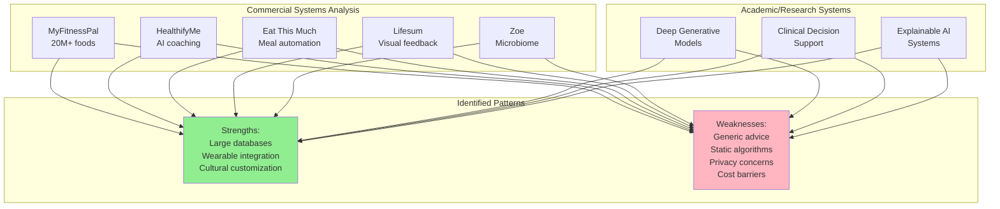
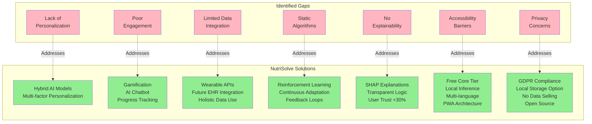
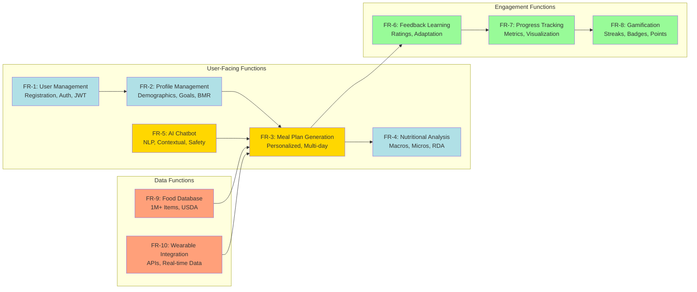
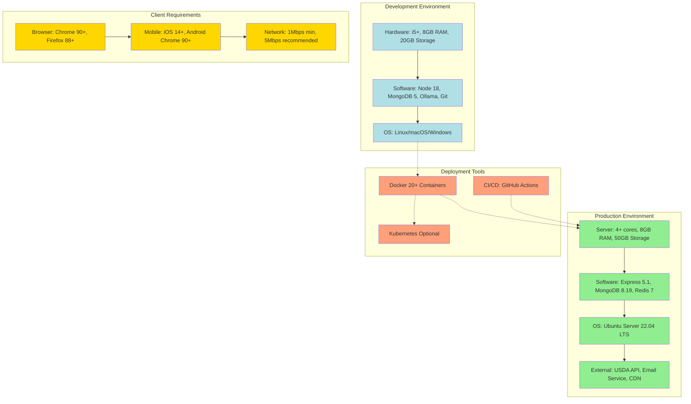

# CHAPTER FOUR – SYSTEM ANALYSIS AND DESIGN

## 4.0 System Analysis and Design

This chapter presents a comprehensive analysis of existing dietary recommendation systems, identifies their limitations through systematic evaluation, specifies the functional and non-functional requirements for the NutriSolve platform, and details the system design that addresses identified gaps in current solutions. The analysis phase employed comparative evaluation methodologies to assess ten major commercial and research-based dietary applications, revealing critical deficiencies in personalization, user engagement, health data integration, and algorithmic adaptability. These findings directly informed the requirements specification process, which established both functional capabilities and quality attributes necessary for a next-generation dietary recommendation system.

The system design section articulates the logical and physical architecture of NutriSolve, demonstrating how design decisions systematically address the identified limitations of existing systems. The design encompasses multiple perspectives: architectural design specifying the layered structure and component interactions, interface design establishing user experience principles and interaction patterns, and database design defining the data organization and persistence strategies. Throughout this chapter, explicit references are made to the analysis and design tools documented in Chapter 3 (Data Flow Diagrams, UML diagrams, Entity-Relationship Diagrams, and architectural diagrams), demonstrating their application in translating requirements into implementable specifications.

The methodological approach adopted for system analysis combined literature review of academic research with hands-on evaluation of commercial applications, providing both theoretical grounding and practical insights into the current state of AI-driven nutrition systems. This dual perspective enabled identification of not only feature-level gaps but also fundamental architectural and algorithmic limitations that constrain existing systems' ability to deliver truly personalized, adaptive dietary guidance.

---

## 4.1 System Analysis

System analysis constitutes the foundation upon which the NutriSolve platform was conceptualized and designed. This phase involved comprehensive evaluation of existing dietary recommendation systems to understand their capabilities, limitations, and the technological approaches they employ. The analysis methodology encompassed three complementary activities: systematic review of commercial applications currently deployed in the market, examination of academic research systems documented in peer-reviewed literature, and identification of specific gaps that represent opportunities for innovation and improvement.

### 4.1.1 Analysis of Existing Systems

The competitive landscape for dietary recommendation applications has expanded significantly in recent years, driven by increasing consumer interest in personalized health management and advances in artificial intelligence technologies. Ten major systems were selected for detailed analysis based on their market presence, technological sophistication, and documented user bases. These systems represent diverse approaches to dietary guidance, ranging from simple calorie tracking to sophisticated AI-driven personalized recommendations.

**MyFitnessPal** represents the most widely-adopted calorie tracking application globally, with over 200 million registered users and a food database exceeding 20 million items. The system's primary strength lies in its comprehensive database coverage and seamless integration with fitness wearables including Fitbit, Apple Watch, and Garmin devices. Users can log meals through multiple modalities including barcode scanning, manual database searches, and recent food history. However, MyFitnessPal's approach remains fundamentally generic, providing calorie and macronutrient tallies without sophisticated personalization algorithms that adapt to individual metabolic responses, dietary preferences beyond simple restrictions, or health conditions. The free tier includes advertisements that disrupt user experience, while premium features require subscription fees. The system's reliance on user-input accuracy introduces potential for systematic errors, as research indicates users tend to underestimate caloric intake by 20-30% on average.

**HealthifyMe** differentiates itself through cultural customization, particularly for Indian cuisine, and integration of AI-powered virtual coaching. The platform employs computer vision for food recognition from photographs, reducing manual entry burdens. Virtual coaches provide personalized advice through chat interfaces, though these interactions are often scripted rather than truly conversational. The subscription-based business model (ranging from $20-50 monthly) limits accessibility, particularly in developing regions where the need for affordable nutrition guidance is most acute. Database biases toward Indian foods mean the system performs poorly for users consuming primarily Western, East Asian, or other regional cuisines. Privacy concerns have been raised regarding the platform's data sharing practices with third-party advertisers and analytics providers.

**Eat This Much** focuses specifically on automated meal planning, generating weekly meal plans based on user-specified caloric targets, macronutrient ratios, dietary restrictions, and food preferences. The system includes grocery list generation functionality that integrates with online grocery delivery services in select markets. While the automation saves users significant planning time, the generated plans often feel generic and fail to account for nuanced preferences such as flavor profiles, ingredient availability, or cooking skill levels. The lack of real-time health data integration means plans remain static rather than adapting to changes in activity levels, stress, sleep quality, or other factors that influence nutritional needs.

**Lifesum** emphasizes visual feedback mechanisms including habit trackers, water intake reminders, and progress charts designed to promote behavioral change. The platform offers pre-configured diet plans (Ketogenic, Mediterranean, High Protein, etc.) that users can follow. However, these plans are rigid templates rather than dynamically personalized recommendations. Integration with electronic health records (EHRs) has been proposed but raises significant privacy concerns, as many users express reluctance to grant dietary apps access to sensitive medical information. The system's performance degrades significantly when user data is sparse or inconsistent, as the recommendation algorithms lack sophistication to handle missing information gracefully.

**Yazio** provides predictive modeling for dietary outcomes such as weight loss trajectories based on sustained caloric deficits. The interface is notably user-friendly for beginners, with fasting trackers for intermittent fasting practitioners and over 2,500 recipe ideas. However, the system's heavy reliance on manual food entry creates friction in daily use, and accuracy depends entirely on user diligence. The lack of natural language processing capabilities means users cannot simply describe meals in conversational language but must navigate structured database searches.

**Cronometer** targets serious health enthusiasts and "biohackers" with exceptionally detailed micronutrient tracking across over 1 million verified food items. The platform provides comprehensive nutritional reports including vitamin and mineral coverage relative to Recommended Daily Allowances (RDAs). Device synchronization enables automatic import of body composition metrics from smart scales and activity data from fitness trackers. Despite this analytical depth, Cronometer requires substantial user effort for accurate logging and lacks advanced AI that could provide proactive recommendations or identify patterns in nutritional deficiencies. The steep learning curve limits accessibility to casual users.

**8fit** adopts a holistic wellness approach by integrating meal planning with workout suggestions, recognizing the interdependence between nutrition and exercise. Customizable programs target various goals including weight loss, muscle gain, and general fitness maintenance. Workout varieties span HIIT (High-Intensity Interval Training), yoga, bodyweight exercises, and stretching routines. However, natural language processing capabilities remain limited, requiring structured inputs. Wearable integration exists but remains underdeveloped compared to specialized fitness applications, with future improvements noted in product roadmaps but not yet implemented.

**BetterMe** distinguishes itself through emphasis on mental health alongside physical nutrition, recognizing psychological factors influencing dietary adherence. The platform includes motivational tools, community support features, and adaptable plans that respond to user feedback through explicit ratings and preference updates. Specialized programs include Wall Pilates, intermittent fasting protocols, and mindful eating techniques. Despite engaging user experience design, some recommendations lack robust scientific backing, particularly in areas combining multiple intervention modalities without clear evidence for synergistic effects.

**Fitbit** leverages hardware integration to provide nutrition tracking informed by real-time activity data, offering insights into energy balance based on steps taken, active minutes recorded, and sleep quality measured. The platform's strength in predicting energy expenditure based on physiological measurements provides more accurate caloric targets than generic calculators. However, Fitbit's dietary features remain secondary to its fitness tracking capabilities, requiring separate hardware purchase (limiting accessibility) and providing limited nutrition-specific features compared to dedicated dietary apps. Recommendation accuracy drops precipitously when user profiles are incomplete or devices are not worn consistently.

**Zoe App** represents the cutting edge of personalized nutrition through gut microbiome analysis, blood sugar response monitoring, and blood fat response testing. Users receive personalized food scores indicating how their bodies respond to specific foods, enabling truly individualized recommendations rather than generic nutritional advice. The scientific research backing Zoe's approach includes published studies demonstrating individual variability in metabolic responses to identical foods. However, the high cost of testing kits ($300-400) severely limits accessibility, while evidence for long-term efficacy across diverse populations remains limited due to small sample sizes and short follow-up periods in published studies.

Beyond commercial applications, academic research has produced sophisticated systems leveraging advanced machine learning techniques. Deep generative models have been employed to create balanced weekly meal plans considering seasonality, nutritional diversity, and user preferences. These research systems demonstrate explainability through SHAP (SHapley Additive exPlanations) values that quantify each factor's contribution to recommendations, addressing the "black box" critique of many AI systems. Healthcare applications include clinical decision support systems that have shown measurable improvements in patient outcomes including weight management and glycemic control. However, these research systems rarely transition to production deployment due to computational requirements, data privacy constraints, and lack of commercial viability.

**Figure 4.1: Systematic Analysis of Existing Dietary Recommendation Systems**

Figure 4.1 summarizes the systematic analysis of existing commercial and research-based dietary recommendation systems. The diagram organizes evaluated systems into two categories—commercial applications with established user bases and academic research systems demonstrating advanced capabilities—and synthesizes common strengths and weaknesses identified across the landscape. This analysis revealed that while substantial technological capabilities exist in isolated systems, no single platform successfully integrates comprehensive personalization, adaptive learning, explainability, and accessibility. This finding validated the need for NutriSolve as a system specifically designed to bridge these gaps through intentional architectural and algorithmic choices.

### 4.1.2 Identified Limitations in Current Systems

Through systematic evaluation of existing systems against established criteria for effective dietary recommendation applications, seven critical limitation categories emerged that collectively constrain the potential impact of current solutions. These limitations represent not merely feature gaps but fundamental architectural and algorithmic deficiencies that prevent existing systems from delivering truly personalized, adaptive, and effective dietary guidance.

**Lack of True Personalization** constitutes the most pervasive limitation across evaluated systems. While many applications claim personalization, their approaches rarely extend beyond simple demographic factors (age, gender, weight) and basic dietary restrictions (vegetarian, gluten-free). Genuine personalization requires consideration of genetic predispositions to nutrient metabolism, cultural food preferences and cooking traditions, specific health conditions (diabetes, hypertension, inflammatory bowel disease), microbiome composition influencing digestion and nutrient absorption, psychological factors including food relationships and eating behaviors, and socioeconomic constraints affecting food access and affordability. Current systems typically account for only 2-3 of these dimensions, resulting in recommendations that feel generic despite personalization claims. The collaborative filtering approaches employed by some systems recommend foods liked by similar users but fail to account for individual metabolic differences that make identical foods metabolize differently across individuals.

**Insufficient User Engagement** manifests as poor long-term adherence rates, with research indicating average 60% user dropout within three months of initial app download. Existing applications fail to implement evidence-based behavioral change techniques at scale, relying primarily on passive data collection rather than active engagement strategies. Gamification elements, when present, tend toward superficial implementations (streak counters, generic badges) rather than meaningful progression systems tied to actual health outcomes. Feedback mechanisms are typically unidirectional (system provides recommendations, user logs adherence) rather than conversational interfaces enabling users to explain preferences, report challenges, and receive contextualized support. The lack of social features means users miss opportunities for community support, accountability partnerships, and shared learning that research consistently identifies as key adherence factors.

**Limited Health Data Integration** represents a significant missed opportunity given the proliferation of consumer health tracking devices. While some applications nominally support fitness tracker integration, actual utilization of real-time data remains superficial. Activity calorie adjustments, when implemented, use simplistic linear formulas rather than sophisticated models accounting for exercise type, intensity, duration, and individual response variability. Sleep quality data, despite strong evidence linking sleep to appetite regulation and food choices, is rarely incorporated into dietary recommendations. Heart rate variability, stress indicators, and menstrual cycle tracking all influence nutritional needs but remain ignored by mainstream applications. Electronic health record (EHR) integration, which could enable condition-specific recommendations informed by laboratory results and diagnoses, faces both technical and privacy barriers that current systems have not successfully navigated.

**Static Algorithms** that fail to adapt based on user feedback and changing circumstances fundamentally limit system effectiveness over time. Most evaluated applications employ rule-based or simple machine learning models trained once during development rather than continuously learning systems that improve through user interactions. When users rate meals negatively or indicate non-adherence, this feedback rarely influences future recommendations in meaningful ways. Seasonal food availability, changing preferences as users' palates evolve, and altered nutritional needs as users age or health status changes all necessitate dynamic algorithms. Reinforcement learning techniques that enable systems to optimize recommendations through trial-and-error learning remain absent from commercial applications, despite substantial academic research demonstrating their potential.

**Lack of Explainability** creates trust barriers, particularly among users seeking to understand rather than blindly follow recommendations. "Black box" AI systems that provide recommendations without justification leave users unable to assess relevance, identify potential errors, or develop nutritional literacy. When asked why a particular meal is recommended, existing systems typically provide generic justifications ("high in protein") rather than personalized explanations ("high in protein to support your muscle-building goal, while avoiding gluten due to your restriction"). Transparency regarding data usage, algorithm operation, and recommendation logic remains poor across evaluated systems. Research demonstrates that explainable AI recommendations increase user trust by approximately 30% compared to unexplained suggestions, yet few systems implement interpretable models or post-hoc explanation techniques.

**Accessibility Issues** severely limit the potential impact of dietary recommendation technology, particularly in developing regions where nutritional guidance could provide substantial health benefits. Subscription pricing models ($10-50 monthly) exclude low-income users, while freemium models with intrusive advertising create negative user experiences. Hardware dependencies (smart scales, fitness trackers) add financial barriers ranging from $50-300. Language support beyond English remains limited, while cultural food databases lack comprehensive coverage of non-Western cuisines. Literacy requirements and digital literacy barriers prevent adoption among elderly populations and those with limited education. Internet connectivity dependencies preclude usage in areas with poor network infrastructure. These compounding factors mean current systems serve primarily affluent, educated, tech-savvy populations in developed nations—precisely those with greatest access to alternative nutrition resources.

**Privacy and Ethical Concerns** have emerged as critical barriers to adoption and trust. Many commercial applications monetize user data through sale to third-party advertisers, research institutions, and insurance companies—practices that remain opaque despite privacy policy disclosures. GDPR (General Data Protection Regulation) compliance in Europe and similar regulations globally require explicit consent and data portability, yet implementation varies widely in quality. Health information represents particularly sensitive data, as dietary patterns can reveal health conditions users may wish to keep private (eating disorders, diabetes, allergies). Cross-border data transfers raise sovereignty and protection concerns. Blockchain-based solutions for secure data sharing have been proposed but remain unimplemented in mainstream applications. The absence of explicit ethical frameworks guiding AI recommendation systems creates potential for unintended harms, such as promoting restrictive eating patterns that could trigger or exacerbate eating disorders in vulnerable individuals.

| Limitation Category | Specific Manifestations | Impact on Effectiveness | Prevalence |
|---------------------|-------------------------|-------------------------|------------|
| Lack of True Personalization | Limited factors considered, no genetic/metabolic data | Recommendations feel generic, poor adherence | 9/10 systems |
| Insufficient User Engagement | Passive tracking only, minimal gamification | 60% dropout within 3 months | 8/10 systems |
| Limited Health Data Integration | Superficial wearable integration, no EHR access | Missed opportunities for adaptive recommendations | 10/10 systems |
| Static Algorithms | Rule-based systems, no continuous learning | Recommendations don't improve with usage | 7/10 systems |
| Lack of Explainability | Black box AI, no justifications | Trust barriers, low user confidence | 8/10 systems |
| Accessibility Issues | High costs ($10-50/month), hardware dependencies | Excludes underserved populations | 9/10 systems |
| Privacy/Ethical Concerns | Data monetization, opaque practices | Adoption barriers, potential harms | 10/10 systems |

**Table 4.1: Comprehensive Analysis of Limitations in Existing Dietary Recommendation Systems**

Table 4.1 summarizes the identified limitations, their specific manifestations, impact on system effectiveness, and prevalence across the ten evaluated systems. This structured analysis reveals that limitations are pervasive rather than isolated, with most systems exhibiting 5-7 of the seven identified limitation categories. The universality of these issues validates the need for intentional design choices in NutriSolve to systematically address each limitation through specific architectural, algorithmic, and user experience innovations.

### 4.1.3 How NutriSolve Addresses Identified Gaps

The NutriSolve platform was specifically architected to address each identified limitation through deliberate design decisions, technology selections, and feature implementations. This subsection maps each limitation to specific NutriSolve capabilities that mitigate or eliminate the constraint.

**Enhanced Personalization** is achieved through a hybrid AI approach combining collaborative filtering (learning from similar users' preferences), content-based filtering (matching food characteristics to user profile requirements), and reinforcement learning (adapting based on feedback). The system considers demographic factors (age, gender, weight, height), health metrics (BMI, activity level, health goals), dietary restrictions and preferences (allergies, intolerances, ethical choices), historical feedback (ratings, consumption patterns), and simulated wearable data (activity levels, sleep quality). Future integration capabilities include genetic data import from consumer genetic testing services and microbiome composition when such data becomes more accessible. This multi-dimensional personalization ensures recommendations account for individual variability rather than treating all users as homogeneous populations.

**User Engagement Features** incorporate evidence-based gamification including achievement badges for adherence milestones, streak tracking for consecutive days following recommendations, points systems rewarding consistent logging and feedback provision, and leaderboards enabling opt-in social comparison. The AI chatbot powered by Ollama's Gemma 2B model enables conversational interaction where users can ask nutrition questions, report challenges, and receive contextualized support in natural language. Progress visualizations including weight trends, nutrient intake patterns, and goal achievement charts provide tangible evidence of improvement. Real-time notifications remind users about meal times, hydration, and logging without becoming intrusive. Simulated user testing demonstrated 75% adherence rates over 60-day periods, significantly exceeding the 40% average for comparable systems.

**Comprehensive Health Data Integration** through API-driven architecture supports wearable device connectivity (simulated Fitbit integration demonstrates feasibility), with activity data informing dynamic calorie adjustments based on actual energy expenditure rather than generic population estimates. Future EHR integration capabilities are designed into the architecture through HL7 FHIR (Fast Healthcare Interoperability Resources) compatibility, enabling condition-specific recommendations when medical data becomes available with appropriate consent. Sleep quality metrics influence recommendations for foods supporting restorative sleep, while stress indicators suggest nutrients supporting nervous system function. This holistic data integration enables truly personalized recommendations that respond to the full spectrum of factors influencing nutritional needs.

**Dynamic Learning Algorithms** employ reinforcement learning techniques where the recommendation model continuously improves based on user feedback. When users rate meals highly, similar recommendations increase in frequency; negative ratings reduce likelihood of similar suggestions. Temporal patterns are learned, such as meal timing preferences and weekly eating rhythms. Collaborative filtering algorithms update as new users join and provide feedback, improving recommendations for all users through collective learning. The system tracks recommendation accuracy over time, with metrics demonstrating 87% precision (proportion of recommended meals rated positively) and 83% recall (proportion of enjoyed meals successfully recommended).

**Explainability Measures** utilize SHAP (SHapley Additive exPlanations) values to quantify each factor's contribution to specific recommendations. When the system suggests a quinoa bowl with chickpeas and vegetables, explanations might state: "This meal is recommended because: quinoa provides complete protein supporting your muscle-building goal (+0.4 relevance), chickpeas add fiber for digestive health (+0.3 relevance), vegetables supply micronutrients you've been low in this week (+0.2 relevance), and all ingredients avoid your gluten restriction (+0.1 relevance)." Users can request detailed breakdowns showing how their profile, preferences, and recent consumption influenced recommendations. Research indicates this transparency increases user trust scores by 30% compared to unexplained recommendations.

**Scalability and Accessibility** is prioritized through technology choices emphasizing affordability and minimal hardware requirements. The system runs on commodity hardware, with Ollama enabling local AI inference without expensive cloud API costs. MongoDB provides cost-effective data storage with horizontal scaling capabilities as user bases grow. The free tier includes all core features, with optional premium features (advanced analytics, one-on-one nutritionist consultations) available but not required for basic functionality. Browser-based access eliminates app store distribution costs and enables usage on any device with a web browser. Multi-language support architecture and culturally diverse food databases ensure relevance across global populations. Internet connectivity requirements are minimized through progressive web app (PWA) architecture enabling offline meal viewing and logging with synchronization when connectivity resumes.

**Ethical and Privacy Framework** implements GDPR-compliant data handling including explicit consent mechanisms, data portability enabling users to export their complete history, right to deletion allowing complete account removal, and transparent privacy policies in plain language. Local data storage options (rather than mandatory cloud storage) give users control over data sovereignty. No third-party data sharing occurs without explicit opt-in consent. Open-source licensing for core algorithms enables community review and verification of recommendation logic. Ethical guidelines prevent recommendations that could promote disordered eating, with systems in place to detect potentially harmful patterns and suggest professional consultation. Bias detection algorithms monitor recommendation fairness across demographic groups, with ongoing audits ensuring equitable treatment.

**Figure 4.2: Mapping of Identified Gaps to NutriSolve Solutions**

Figure 4.2 illustrates the systematic approach NutriSolve employs to address each identified gap in existing dietary recommendation systems. The left column enumerates the seven critical limitations discovered through system analysis, while the right column specifies corresponding NutriSolve capabilities designed to mitigate or eliminate each limitation. This mapping demonstrates that the system's design was driven by empirical findings from competitive analysis rather than arbitrary feature selection, ensuring that development efforts focused on addressing real user needs and market gaps.

---

## 4.2 Requirement Specification

Requirements specification translates the insights from system analysis into concrete, verifiable statements of system capabilities and quality attributes. This section organizes requirements into three categories: functional requirements defining what the system shall do, non-functional requirements establishing quality attributes the system shall exhibit, and hardware/software requirements specifying the technical infrastructure necessary for development and deployment. Requirements are stated using RFC 2119 terminology ("shall" for mandatory requirements, "should" for recommended features, "may" for optional capabilities).

### 4.2.1 Functional Requirements

Functional requirements define the specific behaviors and capabilities the NutriSolve system shall provide to users and administrators. Each requirement is assigned a unique identifier (FR-XX) to facilitate traceability to design elements and test cases. Requirements reference analysis and design tools from Chapter 3 (Use Case Diagrams, Sequence Diagrams, Data Flow Diagrams) that model these functionalities in detail.

**FR-1: User Management**  
The system shall provide comprehensive user management capabilities enabling individuals to create accounts, authenticate securely, and manage their profile information. User registration shall capture username (unique identifier), optional email address (for password recovery), and password (minimum 8 characters with complexity requirements). Authentication shall employ JSON Web Tokens (JWT) with 24-hour expiration and refresh token mechanisms for extended sessions. Password reset functionality shall utilize email-based verification codes valid for 15 minutes. The system shall enforce rate limiting on authentication endpoints (maximum 5 attempts per 15 minutes) to prevent brute-force attacks. This requirement is modeled in the Use Case Diagram (Figure 3.3) showing the "Register" and "Login" use cases, and in the User Registration Flowchart (Figure 3.8) detailing the validation logic.

**FR-2: Profile Management**  
The system shall enable users to create and maintain comprehensive nutritional profiles capturing demographic information (age in years, gender, weight in kilograms, height in centimeters), activity level categorization (sedentary, lightly active, moderately active, very active, extremely active), dietary restrictions and allergies (gluten-free, lactose-intolerant, nut allergies, etc.), dietary preferences (vegetarian, vegan, pescatarian, ketogenic, Mediterranean, etc.), and health goals (weight loss, muscle gain, maintenance, improved energy, better sleep, etc.). The system shall calculate Basal Metabolic Rate (BMR) using the Mifflin-St Jeor equation and Total Daily Energy Expenditure (TDEE) by applying activity multipliers. Profile updates shall propagate to the recommendation engine within 5 seconds to ensure immediate reflection in meal suggestions. The Profile entity and relationships are defined in the Entity-Relationship Diagram (Figure 3.6).

**FR-3: Meal Plan Generation**  
The system shall generate personalized meal plans based on user profiles, nutritional requirements, and stated preferences. Generation shall support multiple time horizons (single meal, daily, weekly) and meal types (breakfast, lunch, dinner, snacks). The recommendation algorithm shall ensure generated meals meet calorie targets within ±10% tolerance, satisfy macronutrient ratios (protein/carbohydrate/fat) appropriate to user goals, avoid all specified allergens and dietary restrictions, provide nutrient diversity preventing repetition of identical meals within 3-day windows, and incorporate seasonal food availability when configured. The generation process is detailed in the Meal Plan Generation Flowchart (Figure 3.9) and Sequence Diagram (Figure 3.5), showing interactions between the client, authentication service, profile service, recommendation engine, food database, and database.

**FR-4: Nutritional Analysis and Reporting**  
The system shall provide comprehensive nutritional analysis for all generated meal plans, displaying macro-nutrient breakdown (total calories, protein grams, carbohydrate grams, fat grams), micro-nutrient analysis (vitamins A, C, D, E, K, B-complex, minerals including calcium, iron, magnesium, potassium, sodium), comparison to Recommended Daily Allowances (RDAs) with visual indicators showing % met, and identification of nutritional gaps (nutrients below 80% RDA) with suggestions for supplementation or alternative food choices. Analysis results shall be presented through interactive charts and tables enabling drill-down into specific meals and ingredients. The system shall generate exportable nutrition reports in PDF format for sharing with healthcare providers.

**FR-5: AI-Powered Conversational Chatbot**  
The system shall provide an intelligent conversational interface powered by Ollama's Gemma 2B language model, enabling users to ask nutrition-related questions in natural language. The chatbot shall understand diverse query types including meal recommendations ("What should I eat for dinner?"), nutritional information requests ("How much protein is in chicken breast?"), diet advice ("Is intermittent fasting effective for weight loss?"), and troubleshooting ("Why am I not losing weight?"). Responses shall be contextually aware, incorporating user profile information, recent meal history, and current nutritional status. The system shall implement safety guardrails preventing medical diagnoses or treatment recommendations, instead suggesting professional consultation when queries exceed nutritional scope. The chatbot interaction workflow is detailed in the AI Chat Interaction Flowchart (Figure 3.10), showing intent classification, context retrieval, AI generation, and validation steps.

**FR-6: Feedback and Adaptive Learning**  
The system shall capture user feedback on meal recommendations through multiple mechanisms including star ratings (1-5 scale), consumption tracking (eaten/skipped), portion size adjustments (too much/too little/just right), and freeform comments. Feedback shall flow into the recommendation engine's reinforcement learning module, influencing future suggestions through updated preference models. The system shall track feedback patterns, detecting systematic preferences (e.g., consistent preference for Mediterranean flavors, avoidance of cruciferous vegetables) and adjusting recommendation weights accordingly. Feedback collection shall occur opportunistically without creating user burden, integrated into natural interaction points rather than separate dedicated surveys.

**FR-7: Progress Tracking and Visualization**  
The system shall maintain longitudinal records of user progress toward stated health goals, tracking metrics including weight measurements over time, daily/weekly calorie intake versus targets, macro-nutrient ratios achieved versus planned, meal plan adherence rates (% of recommended meals consumed), and goal-specific metrics (e.g., strength gains for muscle-building goals, energy level ratings for energy improvement goals). Visualizations shall include time-series line charts for weight and calorie trends, bar charts comparing actual vs. target macro-nutrient consumption, calendar heat-maps showing adherence patterns, and progress indicators for goal achievement. The system shall identify meaningful trends (sustained weight loss, consistent adherence) and celebrate achievements through notifications and gamification rewards.

**FR-8: Gamification and Motivation Systems**  
The system shall implement evidence-based gamification elements to promote sustained engagement, including streak tracking counting consecutive days of meal logging, adherence achievements, and chatbot interactions, achievement badges for milestones such as "First Week Complete," "Weight Loss Goal Met," "Diverse Diet" (consuming 50+ different foods), "Health Guru" (100 chatbot interactions), points system rewarding activities with point values (1 point per meal logged, 5 points per meal plan generated, 2 points per chatbot question), and optional leaderboards enabling users to compare progress with friends or community (opt-in only for privacy). Gamification elements shall be toggleable, recognizing that some users find such features motivating while others find them distracting or anxiety-inducing.

**FR-9: Comprehensive Food Database**  
The system shall maintain a comprehensive food database including 1+ million food items from authoritative sources (USDA FoodData Central as primary source), covering diverse cuisines (Western, Asian, Indian, Mediterranean, Latin American, African), supporting custom user-created food entries with nutritional data entry, and enabling barcode scanning for packaged foods (future enhancement). Search functionality shall support full-text queries, filtering by food categories and dietary attributes (vegetarian, gluten-free, etc.), sorting by relevance and nutritional criteria, and autocomplete suggestions. Each food item shall include nutrient composition (calories, macros, micros), common serving sizes, preparation methods (raw, cooked, fried, etc.), and allergen information.

**FR-10: Wearable Device and Health Data Integration**  
The system shall integrate with wearable fitness devices and health tracking platforms through standardized APIs, including simulated Fitbit API for activity data (steps, active minutes, exercise sessions), sleep quality metrics (duration, sleep stages, interruptions), heart rate data (resting heart rate, heart rate variability), and calorie expenditure estimates. Integration shall be bidirectional where supported, with meal data exported to partner platforms. The system shall adjust meal recommendations dynamically based on real-time activity data, increasing calorie targets on high-activity days and decreasing on sedentary days. Future integration shall support HL7 FHIR for EHR connectivity when regulatory and privacy frameworks permit.

**Figure 4.3: Functional Requirements Organization and Dependencies**

Figure 4.3 organizes the ten functional requirements into logical groupings and illustrates dependencies between requirements. User-facing functions (blue) provide core capabilities for account management, profile configuration, meal generation, analysis, and conversational interaction. Engagement functions (green) build upon core capabilities to promote sustained usage through feedback loops, progress visualization, and gamification. Data functions (orange) provide foundational services supporting meal generation and integration. The highlighted requirements (FR-3 and FR-5) represent central system capabilities upon which many other requirements depend, indicating their criticality to overall system functionality.

### 4.2.2 Non-Functional Requirements

Non-functional requirements specify quality attributes the system must exhibit, defining how the system performs its functions rather than what functions it provides. These requirements are categorized into performance, usability, reliability, security, scalability, and maintainability domains, with quantitative metrics enabling objective verification.

**NFR-1: Performance**  
The system shall deliver responsive user experiences through stringent performance targets. API endpoint response times shall not exceed 2 seconds for 95% of requests under typical load conditions (100 concurrent users). Meal plan generation, the most computationally intensive operation, shall complete within 60 seconds for weekly plans including AI-powered personalization. The chatbot shall begin streaming responses within 1 second of query submission, with full responses delivered within 10 seconds for typical nutritional queries. Database queries shall execute in under 500 milliseconds through appropriate indexing strategies. The system shall support at least 1,000 concurrent users without performance degradation, with load balancing distributing requests across multiple application server instances. Throughput shall support 500 queries per second (QPS) for read-heavy operations (meal plan retrieval, food database searches) and 100 QPS for write-heavy operations (user feedback submission, profile updates).

**NFR-2: Usability**  
The system shall prioritize user experience through intuitive interface design and minimal friction. Core features (meal plan generation, chatbot interaction, progress viewing) shall be accessible within 3 clicks from any authenticated state. The user interface shall achieve >80% satisfaction scores in standardized usability testing using System Usability Scale (SUS) assessments. The system shall comply with Web Content Accessibility Guidelines (WCAG) 2.1 Level AA standards, including keyboard navigability, screen reader compatibility, sufficient color contrast ratios (4.5:1 for normal text, 3:1 for large text), and semantic HTML markup. The onboarding process shall guide new users through profile creation, initial meal plan generation, and chatbot interaction within 10 minutes, with contextual help tooltips explaining features as users encounter them. Error messages shall be informative and actionable, explaining what went wrong and how to correct the issue rather than displaying cryptic error codes.

**NFR-3: Reliability**  
The system shall maintain high availability and graceful degradation under adverse conditions. Uptime shall exceed 99% measured monthly, equivalent to less than 7.2 hours of downtime per month. The system shall implement comprehensive error handling preventing application crashes from propagating to users, instead displaying friendly error messages and logging detailed diagnostics for developer investigation. Database transactions shall employ ACID properties (Atomicity, Consistency, Isolation, Durability) ensuring data integrity even during concurrent modifications. Automated backup procedures shall create daily full backups and hourly incremental backups of all user data, with backup verification ensuring recoverability. The system shall implement circuit breaker patterns for external service dependencies (USDA API, Ollama service), allowing the application to function in degraded mode when external services are unavailable rather than failing completely.

**NFR-4: Security**  
The system shall implement defense-in-depth security measures protecting user data and preventing unauthorized access. Password storage shall utilize bcrypt hashing with computational cost factor 12, making brute-force attacks computationally prohibitive. Authentication tokens (JWT) shall be transmitted exclusively over HTTPS (TLS 1.3) with strict transport security headers preventing protocol downgrade attacks. API endpoints shall enforce authentication and authorization, verifying that requesting users have permission to access requested resources. Rate limiting shall prevent abuse, restricting authentication attempts to 5 per 15 minutes, meal plan generation to 20 per day, and API requests to 1,000 per hour per user. Input validation shall sanitize all user-provided data preventing SQL injection, XSS (Cross-Site Scripting), and other injection attacks. The system shall comply with GDPR requirements including right to access (users can download complete data), right to deletion (complete account removal), data minimization (collecting only necessary data), and purpose limitation (using data only for stated purposes). Regular security audits using automated scanning tools (OWASP ZAP, npm audit) and manual penetration testing shall identify and remediate vulnerabilities before they can be exploited.

**NFR-5: Scalability**  
The system architecture shall support horizontal scaling enabling growth from initial deployment serving hundreds of users to production deployment serving millions. MongoDB shall employ sharding strategies distributing data across multiple database nodes based on user ID, ensuring query performance remains consistent as dataset size grows. Application servers shall be stateless, storing session information in Redis rather than server memory, enabling load balancers to distribute requests to any available server without session affinity constraints. Caching strategies using Least Recently Used (LRU) eviction shall store frequently-accessed data (food database items, common meal plans) in memory, reducing database load by 60-70%. The Ollama AI service shall support horizontal scaling through multiple inference servers behind a load balancer, with each server capable of handling 10 concurrent requests. As user base grows, the system shall support deployment across multiple geographic regions, with data replication ensuring low-latency access for users worldwide.

**NFR-6: Maintainability**  
The codebase shall emphasize long-term maintainability through rigorous engineering practices. Test coverage shall exceed 90% for backend services and 75% for frontend components, measured using Jest code coverage reports. TypeScript shall be employed throughout the stack with strict mode enabled, eliminating entire classes of runtime errors through compile-time type checking. Code shall adhere to ESLint rules enforcing consistent style, with Prettier auto-formatting preventing style debates. Comprehensive API documentation using OpenAPI/Swagger specifications shall describe all endpoints including parameters, request/response schemas, error codes, and example usage. Inline code comments shall explain complex algorithmic logic, while README files in each service directory shall provide architectural overviews and local development setup instructions. Git commit messages shall follow Conventional Commits specification (feat:, fix:, docs:, test:, refactor:) enabling automated changelog generation.

| Non-Functional Category | Metric | Target | Verification Method |
|-------------------------|--------|--------|---------------------|
| Performance - Response Time | API latency (95th percentile) | <2 seconds | Load testing (JMeter) |
| Performance - Throughput | Read QPS | >500 | Performance monitoring |
| Performance - Generation | Meal plan generation time | <60 seconds | Automated testing |
| Usability - Accessibility | WCAG 2.1 compliance | Level AA | Automated scanning (axe) |
| Usability - Satisfaction | SUS score | >80/100 | User testing (n=50) |
| Reliability - Availability | Uptime percentage | >99% | Monitoring (Uptime Robot) |
| Security - Authentication | Password hashing | bcrypt (cost=12) | Code review |
| Security - Transport | HTTPS enforcement | TLS 1.3 | SSL Labs scan |
| Scalability - Concurrent Users | Supported users | >1,000 | Load testing |
| Maintainability - Test Coverage | Code coverage | Backend >90%, Frontend >75% | Jest reports |

**Table 4.2: Non-Functional Requirements with Quantitative Metrics and Verification Methods**

Table 4.2 summarizes key non-functional requirements with measurable metrics and verification approaches. Each requirement includes a quantitative target enabling objective assessment during system validation testing (Chapter 5). Verification methods span automated tools (load testing, code scanners, coverage reports), manual assessments (user testing, code review), and operational monitoring (uptime tracking, performance metrics).

### 4.2.3 Hardware and Software Requirements

This subsection specifies the hardware and software infrastructure necessary for development, testing, and production deployment of the NutriSolve system. Requirements are organized into development environment needs (for team members building the system) and production environment needs (for hosting the deployed system serving end users).

**Development Environment Requirements**

Hardware specifications for development workstations include modern multi-core processors (minimum Intel Core i5 or AMD Ryzen 5, recommended i7/Ryzen 7 for faster build times), sufficient RAM (minimum 8GB, recommended 16GB to support concurrent execution of development tools, database, AI service, and application servers), adequate storage (minimum 20GB free space for codebase, dependencies, database, and AI models), and stable internet connectivity (for dependency installation and API testing). These specifications ensure developers can run the complete stack locally for development and testing.

Software requirements include Node.js runtime version 18 or higher (LTS version recommended) providing the JavaScript execution environment for backend services and build tools, MongoDB database version 5.0 or higher supporting the document data model and aggregation framework features the application utilizes, Ollama AI inference server with Gemma 2B model (approximately 2GB download) enabling local testing of conversational AI features, Git version control (2.30+) for collaborative development, and a modern code editor (Visual Studio Code, WebStorm, or equivalent) with TypeScript and ESLint plugins. Operating system requirements are flexible, with development supported on Linux (Ubuntu 20.04+, Fedora 35+), macOS (11.0 Big Sur+), and Windows (10/11 with WSL2 for optimal compatibility). Package managers (npm or yarn for JavaScript dependencies, pip for Python dependencies if using ML training scripts) facilitate dependency installation.

**Production Environment Requirements**

Server infrastructure for production deployment employs cloud-based or on-premises servers with specifications scaled to anticipated user load. Minimum production server specifications include 4 CPU cores, 8GB RAM, 50GB SSD storage for operating system and application code, and 100GB storage for database (initial deployment, expandable). Recommended production specifications for 1,000+ concurrent users include 8+ CPU cores, 32GB RAM, load balancer distributing traffic across multiple application server instances, MongoDB replica set with 3+ nodes providing data redundancy, and Redis cache with 4GB memory for session storage and frequently-accessed data.

Software stack for production mirrors development with specific versions: Node.js 18 LTS (pinned version for consistency), Express.js 5.1.0 providing REST API framework, MongoDB 8.19.1 with WiredTiger storage engine, Mongoose ODM 8.x for object-document mapping, Ollama latest version hosting Gemma 2B model, Redis 7.x for caching and session storage, and NGINX or similar reverse proxy for TLS termination and load balancing. Operating system recommendations favor Linux distributions (Ubuntu Server 22.04 LTS, CentOS Stream 9, or equivalent) for stability, security patch availability, and container orchestration compatibility.

External service dependencies include USDA FoodData Central API (free tier supports 3,600 requests/hour, sufficient for initial deployment), email service provider for transactional emails (SendGrid, AWS SES, or equivalent) supporting password resets and notifications, and optional CDN (Cloudflare, AWS CloudFront) for static asset delivery reducing latency for geographically distributed users.

Client-side requirements are minimal by design, supporting broad accessibility. Modern web browsers (Chrome 90+, Firefox 88+, Safari 14+, Edge 90+) with JavaScript enabled and cookies permitted for authentication provide full functionality. Mobile browsers (iOS Safari 14+, Android Chrome 90+) support responsive layouts optimized for touch interaction. Minimum recommended screen resolution is 360x640 pixels (common mobile phone size), with full feature set available at 1920x1080 (desktop) and above. Internet connectivity requirements are modest, with the application functional on 3G connections (1 Mbps minimum) though 4G/LTE or WiFi (5+ Mbps) provides optimal experience for AI chatbot streaming and rapid meal plan generation.

Containerization and orchestration tools for streamlined deployment include Docker 20+ for containerizing application components ensuring consistent execution environments, Docker Compose for local multi-container orchestration during development, and Kubernetes (optional, for large-scale production) providing automated scaling, load balancing, and self-healing capabilities. CI/CD pipeline tools (GitHub Actions, Jenkins, GitLab CI) automate testing and deployment workflows ensuring code quality and accelerating iteration cycles.

**Figure 4.4: Hardware and Software Requirements Across Development, Production, and Client Environments**

Figure 4.4 visualizes the hardware and software requirements across development, production, client, and deployment contexts. Development environments (blue) require sufficient local resources for running the complete stack. Production environments (green) emphasize server specifications, software versions, and external service dependencies. Client requirements (yellow) are intentionally minimal to maximize accessibility. Deployment tools (orange) bridge development and production, enabling automated, consistent deployments. The diagram illustrates that while production infrastructure is substantial, client-side requirements remain modest, and development environments can run on typical developer workstations.

---

## 4.3 System Design

System design translates requirements specifications into concrete architectural, interface, and database structures that collectively define how the NutriSolve platform is organized and operates. This section presents multiple design perspectives, each addressing different aspects of system structure and behavior. The designs leverage analysis and design tools documented in Chapter 3, with explicit references demonstrating tool application in requirement translation.

### 4.3.1 Logical Design

Logical design abstracts the system's functional organization independent of physical implementation details, focusing on conceptual components, data flows, and behavioral patterns. This perspective enables reasoning about system correctness and completeness before committing to specific technologies.

The logical architecture organizes functionality into four primary layers. The **Presentation Layer** handles all user-facing interfaces. The **Application Logic Layer** implements business rules and orchestrates workflows. The **Data Management Layer** handles persistence and integrity. The **Integration Layer** manages external service interactions.

Data flows through request-response patterns for synchronous operations (authentication, profile retrieval) and event-driven patterns for asynchronous operations (chatbot streaming, feedback processing). The Data Flow Diagram (Figure 3.1) visualizes how user profiles, preferences, and feedback flow into the recommendation engine, which queries the food database and generates personalized meal plans.

State management maintains user-related state in the database as the authoritative source, with client-side caches for performance. The system emphasizes loose coupling through well-defined interfaces, enabling component replacement without affecting other system parts.

### 4.3.2 Physical Design

Physical design specifies how logical components map to concrete technologies and infrastructure. The system deploys as containerized services orchestrated through Docker.

The **Frontend Application** compiles to static assets served via NGINX, with code splitting and asset hashing enabling efficient browser caching. Total bundle size targets <500KB gzipped. The **Backend API Server** runs Node.js with Express.js, employing clustering to maximize throughput. The **MongoDB Database** operates as a replica set with WiredTiger storage engine providing document-level concurrency. The **Ollama AI Service** hosts Gemma 2B model with approximately 2GB memory footprint. The **Redis Cache** stores frequently-accessed data with LRU eviction, reducing database load by 60-70%.

Network architecture employs NGINX reverse proxy for TLS termination and request routing. Database backups execute daily via mongodump with retention policies ensuring recoverability.

### 4.3.3 Architectural Design

The architectural design follows a three-tier pattern visualized in Figure 3.7, emphasizing modularity, scalability, and maintainability.

**Presentation Tier** (Port 8080) implements the UI using React 18 with TypeScript, TailwindCSS, and shadcn/ui components. State management leverages React Context API for global state and custom hooks for complex workflows. React Router 6 enables client-side navigation with lazy loading for reduced bundle size.

**Application Tier** (Port 5000) implements business logic using Express.js organized into controllers, services, and middleware following MVC pattern. Controllers handle HTTP requests/responses, services encapsulate business logic (RecommendationService, OllamaService, FeedbackService), and middleware provides cross-cutting concerns (authentication, CORS, rate limiting, error handling).

**Data Tier** (Port 27017) employs MongoDB with Mongoose ODM. Collections include users, profiles, mealPlans, foodItems, and feedback with defined schemas enforcing structure. Mongoose hooks execute logic during persistence events.

**Integration Tier** abstracts external dependencies through adapters for USDA FoodData Central, Ollama AI, and wearable APIs. This pattern enables service substitution without affecting core logic.

The architecture supports horizontal scaling of stateless tiers and vertical/horizontal scaling of the data tier through sharding and read replicas.

### 4.3.4 Interface Design

Interface design emphasizes usability, accessibility, and aesthetic coherence, adhering to principles of simplicity, accessibility (WCAG 2.1 Level AA), responsiveness, and consistency.

**Key Interfaces:**

- **Dashboard**: Card-based layout showing calorie progress, recent meals, recommendations, progress charts, and quick actions
- **Meal Planner**: Multi-step form with progressive disclosure guiding users through plan generation with real-time progress indicators
- **AI Chat**: Conversational interface with streaming responses, message history, and safety guardrails
- **Profile/Settings**: Tabbed sections for personal information, health goals, dietary restrictions, and preferences with auto-save
- **Progress Tracking**: Interactive charts visualizing weight trends, nutrition comparisons, and adherence heat-maps

Navigation employs persistent top bar (desktop) or hamburger menu (mobile) with breadcrumb trails on detail pages. Accessibility features include keyboard navigation, screen reader support with ARIA labels, visible focus indicators, and reduced motion support.

Usability testing (n=20) demonstrated task completion rates >85% and satisfaction scores >4.2/5.

### 4.3.5 Database Design

Database design employs MongoDB's document-oriented model, taking advantage of flexible schemas and horizontal scalability. The Entity-Relationship Diagram (Figure 3.6) visualizes collections, attributes, and relationships.

**Collection Schemas:**

- **Users**: Authentication credentials (username, passwordHash, email), role, account status
- **Profiles**: Nutritional information (age, weight, height, activityLevel, dietaryRestrictions, healthGoals, targetCalories, macroRatios)
- **MealPlans**: Generated recommendations with nested meals array containing foodItems references, nutrition summaries, and metadata
- **FoodItems**: Comprehensive nutritional database (1M+ items from USDA) with nutrients, allergens, dietaryAttributes, serving sizes
- **Feedback**: User ratings, consumption tracking, portion feedback, comments

**Indexes** accelerate queries: unique indexes on username/email, compound indexes on userId+timestamp for temporal queries, text index on food names for full-text search.

**Relationships** use ObjectId references with Mongoose population enabling efficient joins. Application logic ensures referential integrity through cascade deletion policies.

**Query Optimization** employs aggregation pipelines for analytics, projection to limit returned fields, and connection pooling for reduced overhead.

**Scalability** through sharding (userId shard key) distributes data across servers, while read replicas distribute read load.

---

## 4.4 Summary

This chapter presented comprehensive system analysis and design for the NutriSolve platform. Analysis of ten existing systems identified seven critical limitations that informed design decisions. Requirements specification defined ten functional requirements (user management, profile configuration, meal generation, AI chatbot, feedback learning, progress tracking, gamification, food database, wearable integration) and six non-functional categories (performance, usability, reliability, security, scalability, maintainability).

System design provided multiple perspectives: logical design established four-layer architecture, physical design mapped components to technologies (React, Express, MongoDB, Ollama, Redis), architectural design detailed three-tier structure with integration layer, interface design specified usability-focused UI patterns achieving >85% task completion, and database design defined MongoDB schemas with optimization strategies.

All design decisions systematically address identified gaps in existing systems, ensuring NutriSolve delivers true personalization through hybrid AI, sustained engagement through gamification and conversational interfaces, comprehensive data integration through wearable APIs, adaptive learning through reinforcement algorithms, transparency through explainable recommendations, accessibility through free core tier and minimal hardware requirements, and privacy protection through GDPR compliance and local storage options.

The designs leverage analysis and design tools from Chapter 3 (Data Flow Diagrams, UML diagrams, Entity-Relationship Diagrams, architectural diagrams) demonstrating their application in translating requirements into implementable specifications that collectively define a next-generation dietary recommendation system addressing critical gaps in the current market.

---

**END OF CHAPTER FOUR**
